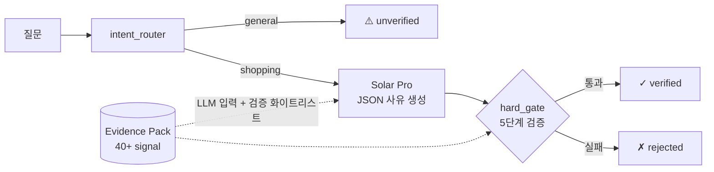

# Commerce Behavior Purchase Prediction with RAG-based Shopping Advisor
### 이커머스 구매 행동 예측 + RAG 기반 쇼핑 어드바이저

## 개요

RecSys 프로젝트. 4개월(2019-11~2020-02) 이커머스 행동 로그를 시계열로 학습해 **다음 1주일에 사용자가 구매할 top-10 아이템**을 예측한다. 평가 지표는 **NDCG@10 (binary relevance)**. production RecSys 컨벤션 (retrieval → ranking → re-ranking) 을 따라 **Stage 1 retrieval (후보 생성) → Stage 2 ranking (LGBM reranker) → Stage 3 re-ranking (5섹션 multi-objective carousel)** 을 구축하고, 그 위에 **RAG 기반 쇼핑 어드바이저** 를 application/explainer layer로 얹어 확장한다.

## 주요 차별점

- **Classical KNN이 transformer 4종 (BSARec 등 SOTA 포함) 압도** - TIFU-KNN +20.5% public vs BSARec, 5-segment 진단 분석으로 mechanism 정량 증명 ([docs/diagnosis_tifu_vs_bsarec.ipynb](docs/diagnosis_tifu_vs_bsarec.ipynb))
- **Full 3-stage RecSys + Explainer** - Stage 1 retrieval (10여 종 ablation) → Stage 2 ranking (LGBM Learn-to-Rank, +15.2% lift) → Stage 3 re-ranking (5섹션 multi-objective carousel) → RAG explainer 까지 production 컨벤션 전 구간 구현
- **Calibration framework** - family-agnostic self-val ↔ public ratio 측정 인프라로 미제출 모델 의사결정 가능
- **RAG-based Shopping Advisor with hard-gate trust layer** - Evidence Pack (약 40가지 signal) + claim 단위 evidence_ref whitelist + 5단계 hard-gate. shopping 모드 응답이 자동 검증 가능 (아래 상세)

## RAG 기반 쇼핑 어드바이저 (핵심 차별점)

> **"LLM은 추천을 고르지 않고, 모델이 고른 추천을 자동 검증된 사유로 설명한다."**

추천 LLM은 보통 근거 없는 자유 발화가 가능해 신뢰가 어렵다. 이 시스템은 shopping 모드에서 **LLM의 모든 주장을 코드 레벨에서 자동 검증**한다.

### 5단계 hard-gate

| # | 검사 | 차단 대상 |
|---|---|---|
| 1 | `user_id` 일치 | 다른 사용자 데이터 섞임 |
| 2 | `item_id` ∈ 추천 후보 | 추천 밖 상품 끌어옴 (hallucination) |
| 3 | `evidence_ref` ∈ whitelist | 약 40가지 Evidence Pack 항목 밖 인용 |
| 4 | 인용 값 truthy | False / 0 / 빈 컬렉션을 근거로 든 거짓 인용 |
| 5 | bool 의미 모순 | "재고 있음"을 "없음"으로 둔갑시키는 사실 반전 |

→ 일반 RAG는 "근거 안 본 발화"가 가능하지만, 본 구현은 코드 레벨로 차단. **shopping 모드 응답이 자동 평가·검증 가능한 형태**.

### 아키텍처 (요약)



> **전체 상세** (5섹션 carousel 로직, file-flow 다이어그램, 빌드 절차, 데모 시나리오, 한계+후속) **→ [service/README.md](service/README.md)**

## 데이터 특성

데이터는 **638,257 users × 29,502 items**, 총 8.35M events. 이벤트 분포가 극히 불균형 (view 99.78% / cart 0.20% / purchase 0.02%). Validation 구간 (Feb 23-29) 의 마지막 3일에 purchase spike가 발생해 self-val 의 99.7% 가 spike에 몰림. 핵심 가설: "user-item repeat frequency + temporal decay가 dominant signal이며, classical KNN이 transformer baseline을 압도할 수 있다."

## 파이프라인 아키텍처

production RecSys 컨벤션 (retrieval → ranking → re-ranking) 에 EDA와 LLM application layer를 더한 구성:

1. **EDA + 가설 수립** — cart→purchase 전환, Feb 27-29 spike mechanism, repeat-buyer 비율 정량 분석 ([docs/eda_findings.md](docs/eda_findings.md))
2. **Stage 1 — Retrieval (후보 생성)** — ALS / EASE / BSARec (4 windows) / DiffRec / BERT4Rec / BSARec+CL / TIFU-KNN / MB-STR 등 10여 종 모델 ablation. 단독 best = TIFU-KNN (public 0.1175)
3. **Stage 2 — Ranking** — 5개 stage-1 후보의 top-50 union → 51개 feature × 5-fold LGBM (binary, LambdaRank). 최종 best public **0.1358** (+15.2% vs TIFU 단독)
4. **Stage 3 — Re-ranking (Whole-page Composition)** — `service/` 의 5섹션 multi-objective carousel (모델 Top-10 / 비슷한 분들이 산 / 내 취향 / 새로 나온 / 다시 살펴볼). 각 섹션이 자체 retrieval + ranking 으로 다른 objective (CF / content affinity / freshness / revisit)를 표현, carousel 단위로 diversity·freshness 강제 ([service/README.md](service/README.md))
5. **Application Layer — RAG-based Shopping Advisor (Explainer)** — Streamlit + LangGraph 7-node + Solar Pro. RAG (Evidence Pack 약 40가지 signal) + claim 단위 hard-gate로 검증 가능한 자연어 추천 사유 생성. ranking에 미관여, 결정된 추천에 대한 사후 설명 layer ([service/README.md](service/README.md))

## 사용 모델

ALS, EASE, BSARec (AAAI 2024), DiffRec (SIGIR 2023), BERT4Rec, BSARec+CL hybrid, TIFU-KNN (SIGIR 2020, 단독 best), MB-STR (multi-behavior), 그리고 LGBM reranker (binary + LambdaRank, 최종 best). 모델별 가설/결과/학습은 [experiments/log.md](experiments/log.md) 에 단일 lab notebook 형태로 통합 기록.

## 디렉토리 구조

```
recsys-commerce/
├── core/                      # 공용 유틸 (data_loader, metrics, validation, submission, ensemble)
├── experiments/               # Stage 1·2 코드 + 단일 lab notebook
│   ├── log.md                 # 모든 실험의 가설/결과/학습 통합 기록
│   ├── exp_NNN_<name>/        # 모델별 실험 (train.py, inference.py, config.yaml)
│   └── ensemble_v*/           # ensemble ablation
├── service/                   # Stage 3 + RAG-based Shopping Advisor (Streamlit + LangGraph + Solar Pro)
│   ├── README.md              # ★ RAG 어드바이저 상세 (5섹션·hard-gate·아키텍처 다이어그램)
│   ├── pipeline/              # 5섹션 carousel + LangGraph nodes
│   ├── evidence_pack/         # RAG 컨텍스트 (40+ signal)
│   ├── trust_gate/            # 5단계 hard-gate
│   └── ui/                    # Streamlit 화면
└── docs/                      # EDA / 모델 카탈로그 / references
```

## 실행 (Quick Reference)

```bash
# 단일 모델 학습 + 추론
cd experiments/exp_NNN_<name>
python train.py && python inference.py

# 최종 LGBM reranker (5-fold CV)
cd experiments/exp_010b_lgbm_lambdarank
python train_cv.py && python inference.py

# RAG 기반 쇼핑 어드바이저 (Streamlit)
cd service
pip install -r requirements.txt
streamlit run ui/app.py
```

## Validation 전략

전 실험 공통: train 마지막 7일 (Feb 23-29) hold-out + `restrict_to_train=True` + `gt_event_types=['purchase']` + active eval_users 928명. exp_001의 `val_gt.parquet` + `eval_users.json` 을 모든 후속 실험이 재활용해 self-val 결과 직접 비교 가능. **Calibration framework**: 측정한 self-val ↔ public ratio가 family 무관하게 2.3-2.6 좁은 범위 (ALS 2.32 / TIFU 2.49 / BSARec 2.53 / LGBM 2.527) - 미제출 모델도 expected public 추정 가능.

## 라이선스

- **데이터**: 대회 주최 측 라이선스를 따름. 본 레포에는 포함되지 않음 (`.gitignore` 처리).
- **자체 작성 코드**: MIT.
- **외부 paper 포팅 코드** (BSARec / DiffRec / BERT4Rec / TIFU-KNN 등): 원본 paper/저자 GitHub 의 라이선스 (Apache-2.0 등) 를 따름. 상세는 [docs/references.md](docs/references.md).