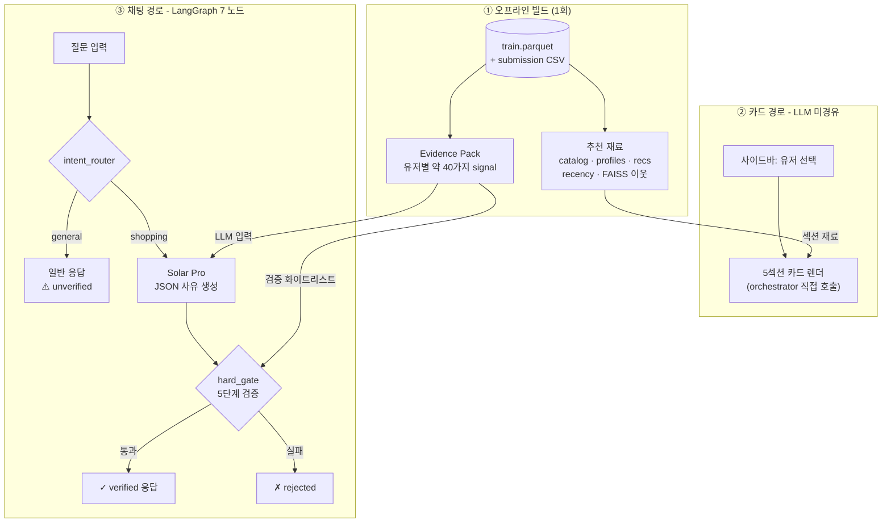
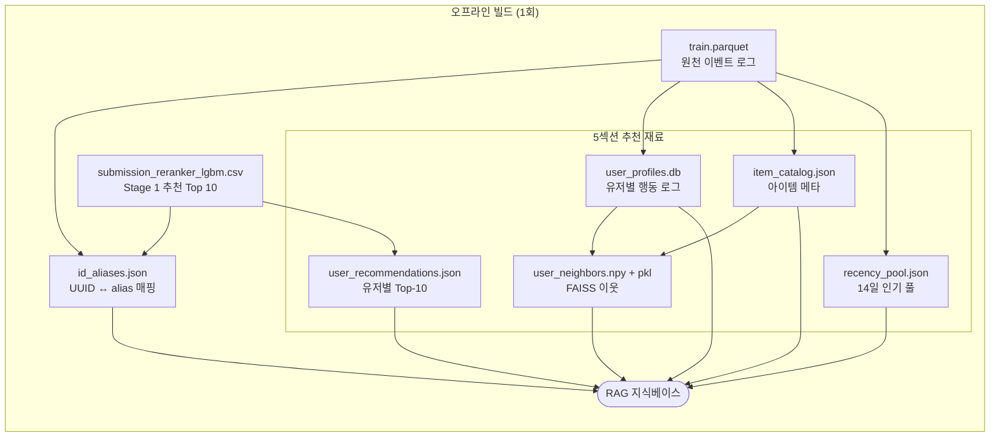

# LLM 커머스 추천 어드바이저 - MVP

> **"LLM은 추천을 고르지 않고, 모델이 고른 추천을 자동 검증된 사유로 설명한다."**

| | |
| --- | --- |
| 백엔드 | LangGraph (7 노드 + MemorySaver) |
| LLM | Upstage Solar Pro · API 없으면 Mock 자동 폴백 |
| 프론트 | Streamlit (사이드바 dropdown + 5섹션 + 채팅) |
| 차별점 | Evidence Pack 약 40가지 signal + claim 단위 **hard_gate** |

---

## 1. 핵심 - 무엇을 푸는가

추천 LLM 챗봇은 보통 "근거 없는 자유 발화"가 가능해서 신뢰가 어렵다.
이 MVP는 shopping 모드에서 LLM의 **모든 주장을 코드 레벨에서 자동 검증**한다.

```
Python(5섹션 후보 선정)  →  Solar Pro(JSON 사유)  →  hard_gate(5단계 검증)  →  UI
```

- 후보 선정에 LLM 미사용 → hallucination 원천 차단
- LLM 응답은 **Evidence Pack**(유저별 사실 카드 - 카테고리 affinity·가격대 적합·최근 활동 등 약 40가지 항목)의 값만 인용 허용
- shopping 모드 = 자동 검증 ✓  ·  general 모드 = ⚠️ 미검증 배지

---

## 2. 5섹션 추천

| # | 섹션 | 선정 로직 | Dedup |
| --- | --- | --- | --- |
| 0 | 모델 Top-10 | submission 순위 그대로 | 시작점 |
| 1 | 비슷한 분들이 산 | FAISS 유사 유저 (선택) | unseen 체인 |
| 2 | 내 취향 | 카테고리·브랜드·가격대 affinity | unseen 체인 |
| 3 | 새로 나온 | 14일 풀 − seen | unseen 체인 |
| 4 | 다시 살펴볼 | seen × event-weight × temporal decay | **독립** |

**Dedup 체인**: 0 > 1 > 2 > 3. Revisit(4)은 seen 풀이라 disjoint → 독립.

---

## 3. Hard-gate - 차별점

`trust_gate/hard_gate.py`가 LLM 응답을 5단계로 검사:

| # | 검사 (코드 용어) | 평이한 의미 |
|---|---|---|
| 1 | `user_id` 일치 | 응답에 다른 사용자 정보가 섞이지 않았는가 |
| 2 | `item_id` 후보 범위 안 | LLM이 추천 후보 밖 상품을 끌어오지 않았는가 (밖 = hallucination) |
| 3 | `claim.evidence_ref ∈ whitelist` ⭐ | LLM이 인용한 **근거 항목 이름**이 Evidence Pack에 사전 정의된 약 40가지 안에 있는가. `evidence_keys()`가 화이트리스트(허용 목록)를 자동 export |
| 4 | 인용 값이 truthy | 근거로 든 값이 실제로 참/유효인가 - `False`/`0`/빈 컬렉션을 근거 삼는 거짓 인용 차단 |
| 5 | bool 의미 모순 | True인 사실을 부정형으로 둔갑시키지 않았는가 (예: "재고 있음"을 "없음"으로 서술) |

> **`evidence_ref`** - LLM이 반환하는 JSON에서 각 주장(claim)에 붙는 "근거 항목 이름". 예: `signals.category_l2_affinity` (이 사용자가 평소 보는 카테고리와 맞다는 신호). 이 이름이 사전 정의된 화이트리스트 밖이면 거부.

```python
# 차단 예시
{"text": "재고 적음", "evidence_ref": "stock_low"}     # 화이트리스트에 없는 이름 ✗

# 통과 예시
{"text": "평소 카테고리와 맞음", "evidence_ref": "signals.category_l2_affinity"}  # ✓
```

→ 일반 RAG는 "근거 안 본 발화"가 가능. 우리는 코드 레벨로 불가능. → 평가·신뢰 가능한 LLM 응답.

---

## 4. 아키텍처

**두 경로가 분리되어 있음**: ① 5섹션 카드는 UI가 orchestrator를 직접 호출해 즉시 렌더, ② 채팅 응답은 LangGraph로 흐르며 hard_gate를 통과해야 노출.



- **`Evidence Pack`이 dual-use**: 같은 파일을 두 곳이 다른 용도로 소비 - LLM에는 "여기 적힌 사실만 인용하세요"라는 **입력**으로, hard_gate에는 "응답이 인용한 이름이 이 목록 안에 있는지" 확인하는 **검증 화이트리스트**(=허용 목록)로
- **카드 경로는 LLM 미경유** - 추천 후보 자체는 결정론적, hallucination 표면적 ↓
- **hard_gate 분기**: 통과한 응답만 사용자 도달, 실패는 응답 차단
- LangGraph 7 노드: `intent_router → alias_resolver → profile_loader → pack_loader → solar_explainer → hard_gate` (+ 분기 `general_chat`). 다이어그램은 핵심만 표시

### 4.1 오프라인 빌드 - 데이터 파일 흐름 (상세)

위 다이어그램의 `offline` subgraph를 파일 단위로 풀어쓴 것.



> **RAG 지식베이스 = 위 모든 산출물을 합친 통합 데이터 레이어**.
> 5섹션 추천 엔진이 SQL·룩업으로 참조. 런타임 검색 방식: **벡터 유사도 X, 단순 키 조회**.
> 모든 산출물은 빌드 시 `id_aliases.json`으로 ID를 매핑함. 다이어그램은 주 소스 1개만 표시(가독성 우선).

**5섹션이 각 노드를 어떻게 쓰는지**:

| 섹션 | 노드 | 핵심 |
|---|---|---|
| 모델 Top-10 | R | user_alias로 미리 저장된 Top-10 그대로 |
| 비슷한 분들이 산 | F + P | F에서 Top-20 이웃 alias 가져오고, P에서 이웃들의 purchase/cart 이력 SQL 조회 → 점수 합산 |
| 내 취향 | P + C | P의 top_categories/brands/price_median과 C의 아이템 메타 매칭 |
| 새로 나온 | Y + P | Y의 14일 풀에서 P의 seen_items 제외 |
| 다시 살펴볼 | P | P의 event_log에 시간 감쇠 × 이벤트 가중치 적용 |

> 노드: P profiles · C catalog · R recs · Y recency · F FAISS 

---

## 5. 모듈 구조

```
service/
├── pipeline/        offline 빌드 + LangGraph (id_alias, orchestrator, graph, ...)
├── advisor/         Solar Pro client + Mock + SYSTEM_PROMPT
├── evidence_pack/   약 40가지 signal + evidence_keys() 화이트리스트
├── trust_gate/      hard_gate + self_check + calibration
├── ui/              Streamlit app + 카드 컴포넌트
└── data/            산출물 (id_aliases / profiles.db / catalog / images / ...)
```

---

## 6. 실행

```bash
cd service
pip install -r requirements.txt
pip install langgraph langchain-core   # LangGraph 추가
```

### 6.1 데이터 빌드 (최초 1회, ~3-5분, 1000 sample 기준)

> 사전 조건: `../baseline/data/train.parquet` — 대회 주최사 원천 데이터. 본 레포에는 포함되지 않음 (`.gitignore`). 별도 다운로드 후 해당 경로에 배치.

```bash
# 0a: alias (전체 638K user)
python -m pipeline.id_alias \
  --train ../baseline/data/train.parquet \
  --submission data/raw/submission_reranker_lgbm.csv \
  --out data/id_aliases.json

# 0b: profile DB - alphabet 1000 sample 중 cart+purchase 상위 300명만 (CF/content 데모 품질용)
python -m pipeline.user_profile \
  --train ../baseline/data/train.parquet \
  --aliases data/id_aliases.json \
  --out data/user_profiles.db --max-users 1000 --active-top 300

# 0c: catalog + recency + recs
python -m pipeline.build_catalog \
  --train ../baseline/data/train.parquet \
  --submission data/raw/submission_reranker_lgbm.csv \
  --aliases data/id_aliases.json --out-dir data

# 0d: Evidence Pack
python -m pipeline.build_rag_index \
  --aliases data/id_aliases.json \
  --submission data/raw/submission_reranker_lgbm.csv \
  --train ../baseline/data/train.parquet \
  --out data/evidence_pack.jsonl --max-users 1000

# 0e: FAISS user-user CF (collaborative 섹션)
python -m pipeline.build_user_vectors \
  --profiles data/user_profiles.db \
  --catalog data/item_catalog.json \
  --out-dir data

# 0f (선택, 데모에선 비활성): Pexels stock photo 캐시
# .env에 PEXELS_API_KEY 설정 후
python -m pipeline.build_images \
  --catalog data/item_catalog.json --out data/item_images.json
```

### 6.2 Streamlit 실행

```bash
# Solar Pro API 사용 (UPSTAGE_API_KEY 필요)
streamlit run ui/app.py

# Mock 모드 (API 비용 0, 데모 가능)
ADVISOR_FORCE_MOCK=1 streamlit run ui/app.py
```

→ `http://localhost:8501` 자동 오픈.

---

## 7. 데모 시나리오

| # | 입력 | 기대 결과 |
| --- | --- | --- |
| 1 | 사이드바 dropdown 상위(활동순) 유저 선택 → "왜 추천?" 버튼 | 5섹션 카드 표시 + Solar 사유 + **trust: verified** |
| 2 | 같은 user → "더 싼 거 있어?" | MemorySaver로 user 유지 + verified 사유 |
| 3 | 같은 user → "오늘 날씨 어때?" | **trust: ⚠️ unverified** (general 경로) |

---

## 8. 데이터 노트

**원본 brand 라벨 그대로 사용**: 데이터셋의 `brand` 컬럼에 `apple/samsung/sony` 등 전자제품 namespace가 `apparel.*` 카테고리와 부조화하게 섞여 있음(원본 라벨링 quirk). 초기엔 가공 fashion 브랜드로 치환했으나, **real-world data의 messiness를 그대로 다루는 게 엔지니어링 시그널로 더 강하다고** 판단해 원복. `brand_remap.py`는 no-op로 남겨두어 downstream import 호환 유지.

**카드 이미지**: 카테고리 기반 stock photo(Pexels)는 item별 사진이 아니라 중복이 심해 데모 가치 낮음 → 비활성화. `data/item_images.json` 파일이 있으면 자동 렌더, 없으면 텍스트 카드.

---

## 9. 한계 + 후속

| 영역 | 현재 | 후속 |
| --- | --- | --- |
| FAISS user-user CF | 구현 완료. 데모는 active-top 300 sample, 서버에서 638K full 빌드 검증 완료 | 풀 빌드 산출물을 정식 데모에 반영 |
| SelfCheckGPT | 코드 있음, 그래프 미연결 | `self_check_node` 추가 |
| Calibration | golden set 라벨 부족 | LLM-Judge 자동 라벨 |
| general 응답 평가 | 불가 (의도적 설계) | 영역으로 명시 |

---

## 10. 시사점

- **"LLM 응답 평가 가능한가?"**: shopping 모드 = YES (Evidence Pack 자동 대조). general 모드 = NO (배지로 명시).
- **3-stage RecSys + LLM 통합 패턴**: retrieval → ranking → re-ranking 위에 LLM explainer 를 얹은 구조 — AWS Personalize + Bedrock 의 mini 구현.
- **Evidence Pack의 일반화 가능성**: 추천 외 다른 도메인(검색, 가격 정책)에도 동일 패턴 적용 가능.

