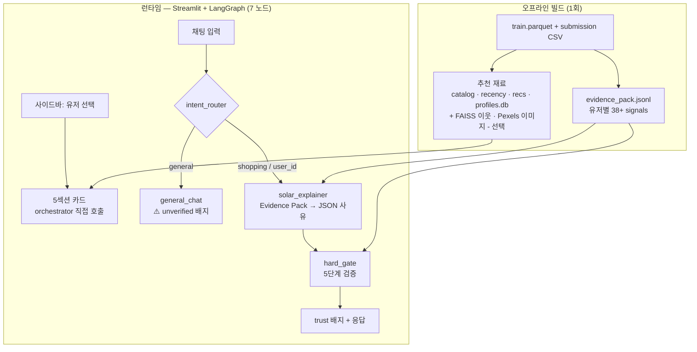

# LLM 커머스 추천 어드바이저 — MVP

> **"LLM은 추천을 고르지 않고, Python이 고른 추천을 자동 검증된 사유로 설명한다."**

| | |
| --- | --- |
| 백엔드 | LangGraph (7 노드 + MemorySaver) |
| LLM | Upstage Solar Pro · API 없으면 Mock 자동 폴백 |
| 프론트 | Streamlit (사이드바 dropdown + 5섹션 + 채팅) |
| 차별점 | Evidence Pack 38+ signals + claim 단위 **hard_gate** |

---

## 1. 핵심 — 무엇을 푸는가

추천 LLM 챗봇은 보통 "근거 없는 자유 발화"가 가능해서 신뢰가 어렵다.
이 MVP는 shopping 모드에서 LLM의 **모든 주장을 코드 레벨에서 자동 검증**한다.

```
Python(5섹션 후보 선정)  →  Solar Pro(JSON 사유)  →  hard_gate(5단계 검증)  →  UI
```

- 후보 선정에 LLM 미사용 → hallucination 원천 차단
- LLM 응답은 Evidence Pack의 38+ signal만 인용 허용
- shopping 모드 = 자동 검증 ✓  ·  general 모드 = ⚠️ 미검증 배지

---

## 2. 5섹션 추천

| # | 섹션 | 선정 로직 | Dedup |
| --- | --- | --- | --- |
| 0 | 🎯 모델 Top-10 | submission 순위 그대로 | 시작점 |
| 1 | 👥 비슷한 분들이 산 | FAISS 유사 유저 (선택) | unseen 체인 |
| 2 | 🧭 내 취향 | 카테고리·브랜드·가격대 affinity | unseen 체인 |
| 3 | ✨ 새로 나온 | 14일 풀 − seen | unseen 체인 |
| 4 | ↩ 다시 살펴볼 | seen × event-weight × temporal decay | **독립** |

**Dedup 체인**: 0 > 1 > 2 > 3. Revisit(4)은 seen 풀이라 disjoint → 독립.

---

## 3. Hard-gate — 차별점

`trust_gate/hard_gate.py`가 LLM 응답을 5단계로 검사:

1. `user_id` 일치
2. `item_id`가 후보 범위 안 (범위 밖 = hallucination)
3. `claim.evidence_ref`가 화이트리스트 안 (`evidence_keys()` 자동 38+ 키)
4. 인용 값이 truthy (False/0/빈 컬렉션 인용 금지)
5. bool 모순 차단 (True 근거를 부정형으로 설명 금지)

```python
# 차단 예시
{"text": "재고 적음", "evidence_ref": "stock_low"}     # 화이트리스트 밖 ✗

# 통과 예시
{"text": "평소 카테고리와 맞음", "evidence_ref": "signals.category_l2_affinity"}  # ✓
```

→ 일반 RAG는 "근거 안 본 발화"가 가능. 우리는 코드 레벨로 불가능.→ 평가·신뢰 가능한 LLM 응답.

---

## 4. 아키텍처

**두 경로가 분리되어 있음**: ① 5섹션 카드는 UI가 orchestrator를 직접 호출해 즉시 렌더, ② 채팅 응답은 LangGraph로 흐르며 hard_gate를 통과해야 노출.



- **`evidence_pack`은 두 곳에서 쓰임**: LLM 입력(허용 signal 목록) + hard_gate 비교 기준(같은 pack)
- LangGraph 7 노드: `intent_router → alias_resolver → profile_loader → pack_loader → solar_explainer → hard_gate` (+ 분기 `general_chat`). 다이어그램은 핵심만 표시

---

## 5. 모듈 구조

```
service/mvp/
├── pipeline/        offline 빌드 + LangGraph (id_alias, orchestrator, graph, ...)
├── advisor/         Solar Pro client + Mock + SYSTEM_PROMPT
├── evidence_pack/   38+ signals + evidence_keys() 화이트리스트
├── trust_gate/      hard_gate + self_check + calibration
├── ui/              Streamlit app + 카드 컴포넌트
└── data/            산출물 (id_aliases / profiles.db / catalog / images / ...)
```

---

## 6. 실행

```bash
cd service/mvp
pip install -r requirements.txt
pip install langgraph langchain-core   # LangGraph 추가
```

# 데이터 빌드 (최초 1회, ~3-5분, 1000 sample 기준)
```bash
# 0a: alias (전체 638K user)
python -m pipeline.id_alias \
  --train ../../baseline/data/train.parquet \
  --submission ../../outputs/submission_reranker_lgbm.csv \
  --out data/id_aliases.json

# 0b: profile DB (1000 sample)
python -m pipeline.user_profile \
  --train ../../baseline/data/train.parquet \
  --aliases data/id_aliases.json \
  --out data/user_profiles.db --max-users 1000

# 0c: catalog + recency + recs
python -m pipeline.build_catalog \
  --train ../../baseline/data/train.parquet \
  --submission ../../outputs/submission_reranker_lgbm.csv \
  --aliases data/id_aliases.json --out-dir data

# 0d: Evidence Pack
python -m pipeline.build_rag_index \
  --aliases data/id_aliases.json \
  --submission ../../outputs/submission_reranker_lgbm.csv \
  --train ../../baseline/data/train.parquet \
  --out data/evidence_pack.jsonl --max-users 1000

# 0e (선택): Pexels stock photo 캐시
# .env에 PEXELS_API_KEY 설정 후
python -m pipeline.build_images \
  --catalog data/item_catalog.json --out data/item_images.json
```

### 7.3 Streamlit 실행

```bash
# Solar Pro API 사용 (UPSTAGE_API_KEY 필요)
streamlit run ui/app.py

# Mock 모드 (API 비용 0, 데모 가능)
ADVISOR_FORCE_MOCK=1 streamlit run ui/app.py
```

→ `http://localhost:8501` 자동 오픈.

---

## 7. 데모 시나리오

| 입력 | 기대 결과 |
| --- | --- |
| 1 | 사이드바 user_00001 선택 → "왜 추천?" 버튼 | 5섹션 카드 표시 + Solar 사유 + **trust: verified** |
| 2 | 같은 user → "더 싼 거 있어?" | MemorySaver로 user 유지 + verified 사유 |
| 3 | 같은 user → "오늘 날씨 어때?" | **trust: ⚠️ unverified** (general 경로) |

---

## 8. 데이터 노트

**Brand 재매핑**: 원 데이터셋의 brand 라벨에 `apple/samsung/sony` 등 전자제품 namespace가 섞여 있어 `apparel.*` 카테고리와 부조화. 데모 시청자가 코드 버그로 오해할 위험이 있어 36개를 가공 fashion 브랜드명으로 1회 치환 (`apple→aurora`, `samsung→sandara`, ...). 매핑표: [`pipeline/brand_remap.py`](mvp/pipeline/brand_remap.py).

**상품 이미지**: Pexels API의 stock photo. **실제 상품 사진이 아닌 데모용**. 캐시 없으면 카드는 텍스트만 표시.

---

## 9. 한계 + 후속

| 영역 | 현재 | 후속 |
| --- | --- | --- |
| FAISS user-user CF | 미빌드 | `build_user_vectors.py` 추가 → 638K full |
| SelfCheckGPT | 코드 있음, 그래프 미연결 | `self_check_node` 추가 |
| Calibration | golden set 라벨 부족 | LLM-Judge 자동 라벨 |
| general 응답 평가 | 불가 (의도적 설계) | 영역으로 명시 |
---

## 11. 시사점

- **"LLM 응답 평가 가능한가?"**: shopping 모드 = YES (Evidence Pack 자동 대조). general 모드 = NO (배지로 명시).
- **2-stage RecSys + LLM 통합 패턴**: AWS Personalize + Bedrock과 동일 구조의 mini 구현.
- **Evidence Pack의 일반화 가능성**: 추천 외 다른 도메인(검색, 가격 정책)에도 동일 패턴 적용 가능.

