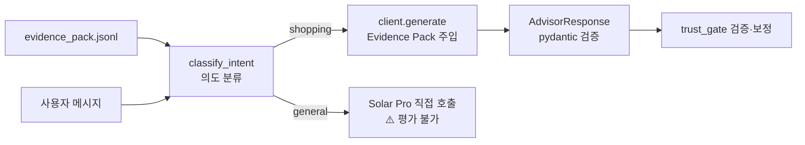

# advisor/ — Solar Pro 호출 + 구조화 응답 + 의도 분류

| 항목 | 내용 |
| ---- | ---- |
| 최종 수정 | 2026-05-28 |
| LLM | Upstage **Solar Pro** API (`solar-pro`) |
| 핵심 역할 | Evidence Pack + 의도 분류 → 구조화 `AdvisorResponse` |
| 모드 | shopping (Evidence Pack 기반, 평가 가능) / general (직접 호출, 평가 불가) |

---

## 무엇인가

Evidence Pack과 "정해진 질문 키"를 받아 **구조화된 LLM 응답**(`AdvisorResponse`)을 만드는 shopping 경로, 그리고 자유 대화를 위한 **의도 분류기**를 함께 제공한다.

real 클라이언트(Upstage solar-pro)와 mock 클라이언트가 같은 인터페이스를 공유해, **API 키도, 본체도 없이 끝까지 데모**된다.

---

## 왜 필요한가

이 단계가 "**LLM이 입을 묶이는**" 곳이다 (RAG 단계).
- 시스템 프롬프트로 "Evidence 밖 발화 금지" + "evidence_ref 인용 의무" 부여
- `response_format=json_object`로 형식 강제 (pydantic 1차 검증)
- 의도 분류로 shopping/general을 분리해 **각 경로에 맞는 처리**를 적용
- alias 문자열 기반 외부 추론 금지 (규칙 8)

→ shopping 경로에서 LLM의 모든 주장이 Evidence Pack 키 하나에 묶이며, 이게 hard_gate의 검증 토대.

---

## 추천시스템·LLM과 어떻게 연결되나



---

## 모드별 동작

### Shopping 모드 (평가 가능)

```python
from advisor import get_client
from evidence_pack import iter_evidence_pack

client = get_client()
pack = next(iter_evidence_pack("data/evidence_pack.jsonl"))
item_id = pack.recommendations[0].item_id

resp = client.generate(pack, item_id, "why")
# resp.claims 각각에 evidence_ref 있음 → hard_gate 검증 가능

samples = client.generate_samples(pack, item_id, "should_buy", n=3)
# N샘플 → SelfCheckGPT 입력
```

### General 모드 (평가 불가, UI에서 ⚠️ 배지)

```python
# ui/app.py의 ask_general() 함수가 직접 처리
# trust_gate를 통과하지 않음
# Evidence Pack 없이 Solar Pro 직접 호출
```

---

## 입력 / 출력

| | 형태 |
|---|---|
| **shopping 입력** | `EvidencePack` + `item_id` + `question_key` |
| **shopping 출력** | `AdvisorResponse` — pydantic 검증된 JSON, claims에 evidence_ref 필수 |
| **general 입력** | 자유 텍스트 메시지 |
| **general 출력** | 원문 텍스트 (검증 없음) |

`AdvisorResponse`의 LLM 외 필드(`confidence_calibrated`, `self_check_score`, `flags`)는 trust_gate가 채워준다. LLM은 채워도 무시됨.

---

## 핵심 파일

| 파일 | 역할 |
|---|---|
| [`schema.py`](schema.py) | `Claim`, `AdvisorResponse` (pydantic). LLM 출력 검증 1차 방어선. |
| [`prompts.py`](prompts.py) | `SYSTEM_PROMPT`, `QUICK_QUESTIONS`, `build_user_message`, `classify_intent`. |
| [`client.py`](client.py) | `SolarProClient` (OpenAI 호환). 실제 API 호출. |
| [`mock_client.py`](mock_client.py) | `MockClient` — Evidence Pack 신호 기반 결정적 mock. |
| [`__init__.py`](__init__.py) | `get_client()` 팩토리 — 환경 따라 자동 선택. |

---

## 빠른 질문 (UI 노출 키) — shopping 모드 전용

[`prompts.py`](prompts.py) `QUICK_QUESTIONS`. Evidence Pack 기반이므로 모든 응답이 검증 가능.

| 키 | 화면 질문 | 탭 |
|---|---|---|
| `why` | 이 상품이 왜 저에게 추천되었나요? | 사용자 |
| `should_buy` | 지금 살 만한가요? | 사용자 |
| `cheaper` | 더 저렴한 대안이 있나요? | 사용자 |
| `fit_preference` | 제 취향과 왜 맞나요? | 사용자 |
| `revisit` | 왜 이 상품을 다시 보면 좋을까요? | 사용자(revisit 후보 선택 시) |
| `category_trend` | 이 카테고리/브랜드가 왜 뜨고 있나요? | 운영자 |
| `promotion_candidate` | 프로모션 후보로 적합한가요? | 운영자 |
| `discontinue_candidate` | 단종 후보로 검토할 만한가요? | 운영자 |

---

## 의도 분류 (classify_intent)

```python
from advisor.prompts import classify_intent, INTENT_CLASSIFY_SYSTEM

intent = classify_intent("이 신발 살까요?")   # → "shopping"
intent = classify_intent("user_00042 추천")   # → "user_id"
intent = classify_intent("오늘 날씨 어때?")   # → "unknown" (→ Solar Pro fallback)
```

3단계 우선순위:
1. `user_\d+` 패턴 직접 감지 (API 호출 없음)
2. 쇼핑 키워드 매칭 (API 호출 없음)
3. Solar Pro 3-class 분류 fallback (`max_tokens=10`)

---

## SYSTEM_PROMPT 핵심 규칙 (shopping 모드)

| 규칙 | 내용 | 위반 시 |
|---|---|---|
| 1 | Evidence Pack 밖 사실 인용 금지 | hard_gate가 차단 |
| 3 | 모든 claim에 evidence_ref 필수 | hard_gate가 차단 |
| 7 | brand/category 외부 의미 추론 금지 | hard_gate가 차단 (ref 없음) |
| 8 | alias 문자열에서 속성 추론 금지 | hard_gate가 부분 차단 (모든 경우 탐지 불가) |
| 9 | revisit 질문은 revisit evidence_ref만 사용 | hard_gate가 빈/거짓 근거를 차단 |

---

## 수정·확장 포인트

| 하고 싶은 것 | 어디서 |
|---|---|
| 새 빠른 질문 | `prompts.py` `QUICK_QUESTIONS` + `mock_client.py` 분기 추가 |
| 의도 분류 키워드 추가 | `prompts.py` `SHOPPING_KEYWORDS` |
| 다른 LLM(OpenAI 등)으로 | `client.py` `base_url`/`model` 또는 `.env` 값 |
| 출력 필드 추가 | `schema.py` `AdvisorResponse` + `SYSTEM_PROMPT` 갱신 |
| 멀티턴 shopping 대화 | `client.py`에 messages 누적 — MVP 범위 내 가능하나 근거 이탈 위험 있음 |

---

## 조정 다이얼

### `prompts.py` — 프롬프트·분류

| 위치 | 기본 | 의미 | 조정 |
|---|---|---|---|
| `SHOPPING_KEYWORDS` | 15개 | 키워드 매칭 의도 분류 | 추가할수록 API 호출 감소. 과검출 주의. |
| `SYSTEM_PROMPT` 규칙 1~3 | Evidence 안의 사실 + ref 필수 | groundedness 핵심 계약 | 약화하면 hard_gate 이전에 환각 가능성↑ |
| `SYSTEM_PROMPT` 규칙 8 | alias 외부 추론 금지 | display alias 오남용 방지 | 삭제 금지 |
| `QUICK_QUESTIONS` | 8개 키 | UI 노출 shopping 질문 | 추가 시 `mock_client.py`에도 분기 필수 |

### `client.py` — 실 LLM 호출

| 위치 | 기본 | 의미 | 조정 |
|---|---|---|---|
| `generate(temperature=)` | 0.4 | 단발 응답 다양성 | 0.2~0.5 권장 |
| sample 시 `max(temperature, 0.7)` | 0.7 | SelfCheck용 다양성 | ↑하면 SelfCheck 더 엄격 |
| `generate_samples(n=)` | 3 | SelfCheck 샘플 수 | **비용 × N배**. 5면 안정↑ |

---

## 한계 / 주의

- `response_format=json_object`는 OpenAI 호환 엔드포인트가 지원해야 함
- general 모드는 trust_gate를 통과하지 않음 — hallucination 탐지 불가 (의도적 설계)
- alias 기반 추론은 SYSTEM_PROMPT로만 방어 — LLM이 규칙을 어기면 hard_gate가 evidence_ref 없는 주장으로 일부 차단하나 완전하지 않음
