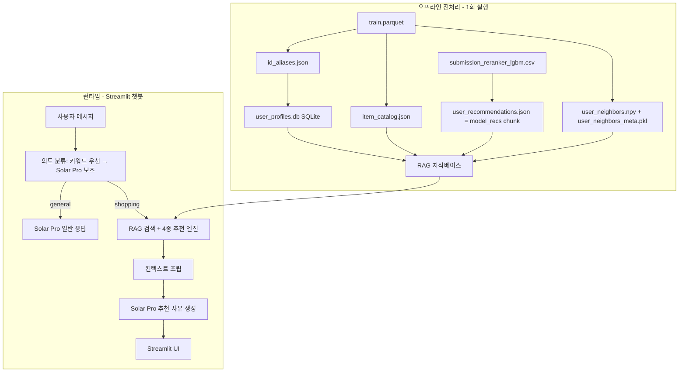
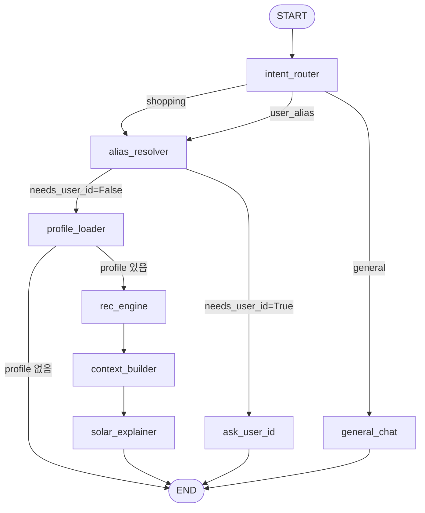

# LLM 기반 이커머스 추천 챗봇 MVP

| 항목 | 내용 |
| ---- | ---- |
| 최종 수정 | 2026-05-28 |
| LLM | Upstage **Solar Pro** API (`solar-pro3`) |
| 파이프라인 | **LangGraph** 상태 그래프 |
| UI | Streamlit |
| 개요 | 경진대회 추천 모델 결과(submission CSV)와 train.parquet를 RAG 지식베이스로 활용해, 채팅 기반 쇼핑 추천 + 자연어 사유 설명 MVP |

상세 모델링·EDA는 [`PLAN.md`](PLAN.md), 운영·CLI는 [`OPERATION.md`](OPERATION.md)를 참고하세요.

---

## 목표

경진대회에서 만든 **추천 모델 결과(submission CSV)** 와 **학습 데이터(train.parquet)** 를 재활용해, 사용자가 채팅으로 대화하면:

1. **일반 대화**와 **쇼핑 추천**을 구분하고
2. 사용자 ID(또는 프로필)를 입력하면 **과거 행동 기반**으로
3. **4가지 추천 유형**(유사 사용자 / 프로필 기반 / 신상품 / 재방문)의 상품과 **Solar Pro가 작성한 추천 사유**를 보여주는 MVP

---

## 전체 아키텍처



---

## 1. 활용할 기존 자산

| 자산 | 경로 | MVP에서의 역할 |
| ---- | ---- | -------------- |
| 행동 로그 | `data/train.parquet` | 유저 프로필, 상품 메타, 유사 사용자 계산 |
| 최종 추천 | `outputs/submission_reranker_lgbm.csv` (또는 ensemble CSV) | **모델이 이미 골라둔 Top-10** → RAG 1순위 근거 |
| 시퀀스 빌드 | `src/data/dataset.py` `build_sequences()` | 최근 본 상품 이력 재사용 |
| 리랭커 피처 | `src/train_reranker_lgbm.py` `build_history_maps()` | cart/purchase/seen 플래그 재사용 |

> **submission을 RAG로 쓰는 의미**: LLM이 "무작위로 상품을 고르는" 것이 아니라, **이미 NDCG@10으로 검증된 추천 결과**를 근거로 설명하게 합니다. train 데이터는 "왜 이 유저에게 맞는지"를 설명하는 **프로필·맥락**을 제공합니다.

---

## 2. ID 별칭 매핑 (사람이 읽기 쉬운 이름)

원본 UUID(`0b517454-e7c3-...`)는 데모·채팅·LLM 응답에 그대로 노출하지 않습니다. **오프라인 1회 생성**하는 양방향 매핑 테이블을 두고, UI·RAG·Solar Pro prompt 전 구간에서 **별칭(alias)만 사용**합니다.

### 저장 위치

```
rag_data/
├── id_aliases/
│   ├── user_alias.json      # user_id ↔ alias ↔ display_name
│   └── item_alias.json      # item_id ↔ Semantic alias (l2.l3.brand.bucket_seq)
```

### A. User ID 매핑

| 필드 | 예시 | 설명 |
| ---- | ---- | ---- |
| `user_id` (원본) | `0b517454-e7c3-...` | train.parquet 키 (내부 lookup용) |
| `user_alias` | `user_00001` | **시퀀셜 번호** (sample_submission 유저 순서 기준) |
| `display_name` | `김민지` | **한국어 가명** (데모 UI dropdown 표시 전용) |

**생성 규칙**

1. `data/sample_submission.csv`의 유저 등장 순서대로 `user_00001` ~ `user_638257` 부여 (재현 가능)
2. 같은 순서에 한국어 가명 638,257개 매핑 (고정 seed로 항상 동일 결과)
3. 채팅/UI에서 표시는 **`김민지 (user_00001)`** 형태
4. **채팅 입력 파싱은 `user_00001` 형태만 허용** → 역매핑으로 원본 `user_id` 조회

> **주의**: `display_name`은 한국어 이름 풀이 한정적이어서 638K 유저에 걸쳐 중복이 대량 발생합니다. "김민지" 입력만으로는 어떤 유저인지 특정할 수 없으므로, `display_name`은 **UI dropdown 표시 전용**으로만 사용하고 채팅 파싱에는 사용하지 않습니다.

```python
# user_alias.json 구조 (1건 예시)
{
  "0b517454-e7c3-44ec-8c39-a68ef9c0ec60": {
    "user_alias": "user_00001",
    "display_name": "김민지"
  }
}
```

### B. Item ID 매핑 — Semantic ID

단순 `{leaf}_{seq}` 방식 대신 **카테고리 계층·브랜드·가격대를 ID 자체에 내재**시킨 Semantic ID를 채택합니다. Solar Pro가 ID만 보고도 상품의 핵심 속성을 추론할 수 있어, prompt의 메타데이터 반복 삽입을 줄일 수 있습니다.

| 필드 | 예시 | 설명 |
| ---- | ---- | ---- |
| `item_id` (원본) | `18c11cbb-a18d-...` | train.parquet 키 |
| `item_alias` | `shoes.keds.kapika.mid_0001` | **{L2}.{L3}.{brand}.{price_bucket}_{seq}** |
| `price_bucket` | `low` / `mid` / `high` | 가격 3분위 (하단 참조) |

**포맷 규칙**

```
L3 있는 경우: {L2}.{L3}.{brand}.{price_bucket}_{seq:04d}
              예) shoes.keds.kapika.mid_0001
L3 없는 경우: {L2}.{brand}.{price_bucket}_{seq:04d}
              예) tshirt.respect.mid_0042
```

- `L2`, `L3`: `category_code` 파싱 (`apparel.shoes.keds` → L2=`shoes`, L3=`keds`)
- `brand`: 원본 brand 값 그대로 사용 (공백은 `_`로 치환)
- `price_bucket`: item별 `price_median` 기준

```python
import re

# category_code 파싱 — L1은 항상 'apparel'(전 상품 동일)이므로 건너뜀
def parse_category(category_code: str) -> tuple[str, str | None]:
    parts = category_code.split(".")      # ["apparel", "shoes", "keds"]
    l2    = parts[1] if len(parts) >= 2 else parts[0]   # "shoes"
    l3    = parts[2] if len(parts) >= 3 else None        # "keds" or None
    return l2, l3

# 가격 버킷 — train.parquet 전체 price_median의 p33/p66 분위수로 결정
# ⚠ 이 데이터의 가격 단위는 ~70~80 스케일 (KRW 아님 — 단위 확인 필수)
# 오프라인 build 시점에 아래처럼 분위수를 먼저 계산한 뒤 함수에 주입
#   p33, p66 = df["price"].quantile([0.33, 0.66])
def make_price_bucket_fn(p33: float, p66: float):
    def price_bucket(price_median: float) -> str:
        if price_median < p33:  return "low"
        if price_median < p66:  return "mid"
        return "high"
    return price_bucket

# 가격 표시 문자열 — 오프라인 단계에서 확정, Solar Pro·UI 전 구간에 일관 주입
# 단위 확인 후 PRICE_SCALE을 결정 (예: 원본이 USD 기준이면 1100, 백원 단위면 100 등)
# 미확인 상태에서는 "약 N단위" 형태로 명시적 레이블 사용
PRICE_SCALE = 1000   # ← Phase 1 시작 전 train.parquet 가격 분포 확인 후 결정

def format_price_display(price_median: float) -> str:
    krw_approx = int(round(price_median * PRICE_SCALE, -2))   # 백 원 단위 반올림
    return f"{krw_approx:,}원"   # 예: "72,000원"

# 브랜드 slug — 영숫자·언더스코어만 허용 (특수문자·공백·비ASCII 제거)
def brand_to_slug(brand: str) -> str:
    return re.sub(r"[^a-z0-9]", "_", brand.lower()).strip("_")

# Semantic ID 조립
def make_item_alias(l2, l3, brand, price_med, seq, price_bucket_fn):
    bucket     = price_bucket_fn(price_med)
    brand_slug = brand_to_slug(brand)
    prefix     = f"{l2}.{l3}.{brand_slug}.{bucket}" if l3 else f"{l2}.{brand_slug}.{bucket}"
    return f"{prefix}_{seq:04d}"
```

**시퀀스 번호 부여 + 충돌 방지**

그룹 키는 slug가 아닌 **원본 brand 값**을 사용합니다. 다른 브랜드명이 동일 slug로 수렴해도(`brand_à` → `brand_a`, `brand_A` → `brand_a`) 그룹이 잘못 합산되지 않습니다.

```python
from collections import defaultdict
import hashlib

def build_item_aliases(items_df, price_bucket_fn) -> dict[str, str]:
    # 그룹 키: 원본 brand 사용 (slug 충돌 방지)
    groups: dict[tuple, list[str]] = defaultdict(list)
    for item_id, row in items_df.iterrows():
        l2, l3     = parse_category(row["category_code"])
        bucket     = price_bucket_fn(row["price_median"])
        group_key  = (l2, l3, row["brand"], bucket)   # ← 원본 brand
        groups[group_key].append(item_id)

    alias_map: dict[str, str] = {}
    seen_aliases: set[str]    = set()          # 전역 중복 체크

    for (l2, l3, brand, bucket), item_ids in groups.items():
        brand_slug = brand_to_slug(brand)
        prefix     = f"{l2}.{l3}.{brand_slug}.{bucket}" if l3 else f"{l2}.{brand_slug}.{bucket}"
        # hash 정렬로 재현 가능한 순서 보장
        sorted_ids = sorted(item_ids, key=lambda x: hashlib.md5(x.encode()).hexdigest())

        current_seq = 1
        for item_id in sorted_ids:
            alias = f"{prefix}_{current_seq:04d}"
            # slug 충돌 시 seq를 독립적으로 증가 — for 루프 변수를 수정하지 않음
            while alias in seen_aliases:
                current_seq += 1
                alias = f"{prefix}_{current_seq:04d}"
            seen_aliases.add(alias)
            alias_map[item_id] = alias
            current_seq += 1

    return alias_map  # 1:1 매핑 보장
```

> **설계 원칙**: 그룹 키는 원본 brand → 시퀀스 배정, slug는 ID 문자열 표현에만 사용. `seen_aliases` 전역 중복 체크로 희귀 충돌도 방어합니다.

**Semantic ID의 LLM 활용 이점**

```
# 기존 방식 — prompt에 메타데이터 매번 명시 필요
keds_0001 (브랜드: kapika, 카테고리: shoes > keds, 가격대: 중간)

# Semantic ID — ID 자체에 의미 내재, 간결한 prompt 가능
shoes.keds.kapika.mid_0001
```

Solar Pro는 `shoes.keds.kapika.mid_0001`만 보고 "keds 스타일 신발, kapika 브랜드, 중간 가격대"를 즉시 파악합니다.

```python
# item_alias.json 구조 (1건 예시)
# price_display: 오프라인 단계에서 PRICE_SCALE 적용한 표시용 문자열 — Solar Pro·UI 전 구간 공용
{
  "18c11cbb-a18d-4a9e-bdea-6abd3f7d3c04": {
    "item_alias": "shoes.keds.kapika.mid_0001",
    "l2": "shoes",
    "l3": "keds",
    "category_code": "apparel.shoes.keds",
    "brand": "kapika",
    "price_bucket": "mid",
    "price_median": 72.05,
    "price_display": "72,000원"   // PRICE_SCALE 확정 후 채워짐
  }
}
```

### C. 별칭이 적용되는 지점

| 구간 | 적용 방식 |
| ---- | --------- |
| Streamlit 유저 선택 | dropdown: `김민지 (user_00001)` |
| 채팅 입력 파싱 | **`user_00001` 형태만** → 원본 user_id 역변환 |
| RAG chunk / profile_text | UUID 대신 `user_00001`, `shoes.keds.kapika.mid_0001` 사용 |
| Solar Pro prompt | "추천 상품: shoes.keds.kapika.mid_0001" (메타 반복 불필요) |
| 추천 결과 UI | 상품명 대신 `shoes.keds.kapika.mid_0001 · 72.05` 카드 (가격 단위 확인 후 포맷 결정) |
| 내부 추천 엔진 | 원본 ID로 lookup, **출력 직전** alias 변환 |

### D. 모듈

```
service/mvp/pipeline/id_alias.py   # build_user_aliases(), build_item_aliases(), resolve_user(), resolve_item()
```

> **주의**: `(L2, L3, brand, price_bucket)` 그룹별로 시퀀스가 독립 시작하므로, `shoes.keds.kapika.mid_0001`과 `tshirt.respect.mid_0001`은 **서로 다른 상품**입니다. Semantic ID 덕분에 LLM·사용자가 UUID 없이도 상품의 주요 속성을 파악하며 대화할 수 있습니다.

---

## 3. User 프로필 만드는 방법

현재 프로젝트에는 별도 프로필 모듈이 없습니다([`PLAN.md`](PLAN.md)의 `build_user_profiles`는 TIFU-KNN용 설계 초안). MVP에서는 **train.parquet에서 오프라인 집계**로 3층 프로필을 만듭니다.

### A. 구조화 프로필 (SQLite, RAG + 추천 엔진용)

유저 프로필은 **SQLite DB** `rag_data/user_profiles.db`에 저장합니다. `user_alias`를 Primary Key로 인덱싱하여 런타임에 전체 로드 없이 O(1) 디스크 룩업합니다.

```
rag_data/
└── user_profiles.db    # user_alias PK 인덱스, 런타임 필요 행만 SELECT
```

> **JSONL 전체 로드 대신 SQLite를 쓰는 이유**: 638K 유저를 전부 인메모리에 올리면 유저당 평균 1KB 기준으로도 640MB+가 되고, `recent_items` 등 리스트 필드가 커질수록 수 GB까지 증가합니다. Streamlit은 소스 변경 시 프로세스를 재시작하므로 매번 로딩 지연이 발생합니다. SQLite는 Python 내장(`sqlite3`)으로 추가 의존성 없이 인덱스 기반 O(1) 접근이 가능합니다.

**스키마**:

```sql
CREATE TABLE user_profiles (
    user_alias    TEXT PRIMARY KEY,
    user_id       TEXT,
    profile_json  TEXT,   -- JSON 직렬화된 전체 프로필
    profile_text  TEXT    -- Solar Pro 주입용 한국어 텍스트
);
-- PRIMARY KEY가 자동으로 인덱스를 생성하므로 별도 CREATE INDEX 불필요
```

유저당 아래 통계를 `profile_json`에 저장:

| 필드 | 계산 방법 | 용도 |
| ---- | --------- | ---- |
| `top_categories_l2` | category_code L2 빈도 Top-5 (view/cart/purchase 가중) | 프로필 기반 추천 |
| `top_brands` | brand 빈도 Top-5 | 프로필 기반 추천 |
| `price_range` | 조회/구매 가격 p25~p75 | 가격대 맞춤 설명 |
| `activity_level` | 전체 이벤트 수, 최근 14일 활동 | "활발한 쇼핑러" 등 서술 |
| `recent_items` | 최근 10개 (**item_alias**, category, brand, event_type) | LLM 맥락 |
| `seen_items` | `{item_alias: {score, event_count, last_event_type, last_event_date}}` — event weight × temporal decay 사전 계산 | unseen 필터(유형1·3) + revisit 점수(유형4) 겸용 |
| `cart_items` | cart 했지만 purchase 안 한 상품 | "장바구니에 담아두신..." |
| `purchased_items` | purchase 이력 (item_alias + purchase_date) | 중복 추천 방지, revisit에서 최근 구매 제외 기준 |

**가중치 예시** (기존 TIFU-KNN·리랭커와 일관):

```python
EVENT_WEIGHT = {"view": 1.0, "cart": 25.0, "purchase": 50.0}
```

**런타임 룩업 패턴** (`profile_loader` 노드):

```python
import sqlite3, json

def profile_loader(state: GraphState) -> GraphState:
    if not state.get("user_alias"):
        state["response"] = "유저 ID를 확인할 수 없습니다. 다시 입력해 주세요."
        return state
    with sqlite3.connect("rag_data/user_profiles.db") as con:
        row = con.execute(
            "SELECT profile_json, profile_text FROM user_profiles WHERE user_alias = ?",
            (state["user_alias"],)
        ).fetchone()
    if row:
        state["profile"] = {**json.loads(row[0]), "profile_text": row[1]}
    else:
        state["response"] = f"{state['user_alias']}에 해당하는 프로필을 찾을 수 없습니다."
    return state
```

### B. 자연어 프로필 (LLM용 텍스트)

템플릿 예시 (Solar Pro에 주입):

```
[사용자 프로필 — 김민지 (user_00001)]
- 선호 카테고리: shoes(42%), tshirt(18%), jacket(12%)
- 선호 브랜드: respect, kapika, ...
- 가격대: mid 버킷 (price p33~p66 구간, 단위 확인 필요)
- 최근 관심: 장바구니에 담은 shoes.keds.kapika.mid_0003, 지난주 jacket.respect.mid_0012 조회 다수
- 활동: 총 23회 조회, 최근 2주 8회 활동
```

### C. 유사도 프로필 (유사 사용자 추천용) — FAISS GPU 배치 계산

638K 유저 전체 user-user 코사인 유사도를 직접 계산하면 float32 기준 약 1.5 TB 행렬로 불가능합니다. **FAISS `IndexFlatIP` + GPU 배치 계산**으로 Top-20 유사 유저를 사전 계산합니다.

**벡터 표현**:
- 각 유저를 **L2 카테고리 17차원 + Top-20 브랜드 one-hot** 벡터로 표현 (L2 정규화 후 내적 = 코사인 유사도)

**FAISS GPU 배치 계산 절차**:

```python
import faiss
import numpy as np

# 1. 유저 벡터 행렬 구성 (638K × D), L2 정규화
vectors = build_user_vectors(train_df)          # shape: (N, D)
faiss.normalize_L2(vectors)

# 2. GPU 인덱스 생성
res   = faiss.StandardGpuResources()
index = faiss.GpuIndexFlatIP(res, vectors.shape[1])
index.add(vectors)

# 3. 배치 검색 (메모리 제어: 1만 유저씩)
BATCH = 10_000
all_neighbors = []
for start in range(0, len(vectors), BATCH):
    D, I = index.search(vectors[start:start+BATCH], k=21)  # k+1 (자기 자신 제외)
    all_neighbors.append(I[:, 1:])   # 자기 자신(rank 0) 제거

# 4. 결과 저장
neighbors = np.vstack(all_neighbors)   # (N, 20)
```

**저장**:

```
rag_data/
├── user_neighbors.npy          # (N, 20) int32 — faiss index 순서 기준 행 번호
├── user_neighbors_meta.pkl     # {faiss_row_idx: user_alias} 역매핑
└── user_alias_to_row.pkl       # {user_alias: faiss_row_idx} 정방향 맵 (런타임 lookup용)
```

**런타임 lookup 절차** (`recommend_cf` 내부):

```python
import pickle, numpy as np

# 오프라인 build 시 한 번만 로드 (st.session_state 또는 모듈 캐시)
alias_to_row = pickle.load(open("rag_data/user_alias_to_row.pkl", "rb"))
row_to_alias = pickle.load(open("rag_data/user_neighbors_meta.pkl", "rb"))
neighbors_npy = np.load("rag_data/user_neighbors.npy")   # (N, 20)

def recommend_cf(profile: dict) -> list[str]:
    row = alias_to_row.get(profile["user_alias"])
    if row is None:
        return []   # FAISS 미빌드 시 빈 리스트 → collaborative 섹션 숨김
    neighbor_rows   = neighbors_npy[row]               # (20,)
    neighbor_aliases = [row_to_alias[r] for r in neighbor_rows]
    # 이웃의 purchase > cart 가중 합산, seen_items 제외 후 Top-N 반환
    ...
```

- 유사 유저가 **purchase/cart**한 상품 중, `seen_items`에 없는 것 추천
- `--sample 1000` 개발 모드에서는 **submission에 포함된 유저만** 샘플링해 인덱스 구성
- **FAISS 미빌드 시 fallback**: `user_alias_to_row.pkl` 없으면 `recommend_cf`가 빈 리스트 반환 → `rec_engine`이 collaborative 키를 빈 리스트로 설정 → Streamlit에서 해당 섹션 숨김 처리

> **참고**: 기존 TIFU-KNN(`src/models/tifu_knn.py`)은 "자기 히스토리만" 쓰므로, "유사 취향 사용자" 추천은 이 **별도 user-user CF 모듈**이 담당합니다.

> **FAISS 범위 명확화**: §3C의 FAISS는 **유사 유저 오프라인 nearest neighbor 전용**입니다. 아래 §4의 "RAG 지식베이스"는 벡터 검색이 아니라 `user_alias` 키 기반 **직접 lookup(SQLite + JSON)**이며, FAISS와 별개입니다.

---

## 4. RAG 지식베이스 구성

> **용어 정리**: 이 문서에서 "RAG"는 `user_alias` → SQLite·JSON 직접 lookup을 가리킵니다. 벡터 임베딩 검색이 아닙니다. FAISS는 §3C의 유사 유저 nearest neighbor 계산에만 사용합니다.

오프라인 스크립트 `service/mvp/pipeline/build_rag_index.py` (신규)로 아래 4종 인덱스 생성:

### Chunk 유형

| Chunk ID | 내용 | 검색 키 |
| -------- | ---- | ------- |
| `user_profile` | 프로필 JSON + profile_text (**user_alias** 포함) | user_alias |
| `model_recs` | submission Top-10 + **Semantic item_alias** (속성 내재) — `rag_data/user_recommendations.json`에 저장 | user_alias |
| `item_meta` | **Semantic item_alias**별 l2/l3/brand/price_bucket, price_median, 인기도 | item_alias / l2 category |
| `similar_user_evidence` | "유사 유저 user_00142가 shoes.keds.respect.mid_0007 구매" 근거 | user_alias |

### 상품 메타데이터 추출

별도 items.csv가 없으므로 train.parquet에서 **item_id별 최신/최빈값** 집계:

```python
# item_id → {category_code, brand, price_median, view_count, last_seen_date}
items = df.groupby("item_id").agg(
    category_code=("category_code", lambda x: x.mode()[0]),
    brand=("brand", lambda x: x.mode()[0]),
    price=("price", "median"),
    ...
)
```

### MVP RAG 검색 방식

638K 유저 규모에서 MVP는 **벡터 DB 없이 직접 lookup**으로 충분:

- `user_alias` → 프로필 + submission + 유사유저 chunk를 **즉시 로드** (내부는 원본 ID, prompt는 alias)
- Solar Pro context window에 **구조화 JSON** (~2K tokens) 주입
- 추후 확장 시: item/category 설명 chunk만 FAISS/Chroma에 임베딩

---

## 5. 4가지 추천 범주 + LLM 사유

각 유형당 **Top-3~5개** 후보를 선정한 뒤, Solar Pro가 **사유만** 자연어로 작성 (상품 선택은 규칙 기반 → hallucination 방지).

### 유형 1: 유사 취향 사용자 기반 (Collaborative)

```
입력: user_neighbors.npy + train purchase/cart 이력
로직:
  1. Top-20 유사 유저 조회 (user_neighbors_meta.pkl로 역변환)
  2. 유사 유저의 purchase > cart > view 순으로 점수 합산
  3. 대상 유저의 seen_items에 없는 상품만 (unseen 필터)
출력 예: "비슷한 취향의 user_00142 등 12명이 구매한 shoes.keds.respect.mid_0007"
```

### 유형 2: 프로필 기반 (Content-based)

```
입력: user_profile + item_catalog
로직:
  1. top_categories_l2 / top_brands와 매칭되는 상품 필터
  2. submission Top-10 중 해당 카테고리/브랜드 우선
  3. 가격대(price_range) 필터
출력 예: "평소 shoes·respect 선호에 맞는 shoes.keds.respect.mid_0023 (모델 2위 추천)"
```

### 유형 3: 신상품 추천 (Recency + Personalized Unseen)

**신상품의 정의**: "데이터 기준 최신 상품" 이 아니라 **"해당 유저가 아직 보지 않은 상품 중 가장 최근에 등장한 상품"** 으로 정의합니다.

**오프라인 캐시 전략**: 런타임마다 전체 item_catalog를 순회하면 활동 많은 유저에서 latency가 급증합니다. 오프라인 build 시점에 신상품 pool을 카테고리별로 미리 정렬해 JSON으로 캐싱해두면, 런타임은 set 차집합 1회로 끝납니다.

```python
# 오프라인 build (build_rag_index.py)
# recency_pool.json: {l2_category: [item_alias, ...], ...} (last_seen_date 내림차순)
recency_pool = defaultdict(list)
for item_alias, meta in item_catalog.items():
    if meta["last_seen_date"] >= cutoff_date:   # 데이터 최종일 - 14일
        recency_pool[meta["l2"]].append(item_alias)
# 각 카테고리 내 submission 순위 기준으로 정렬 후 저장

# 런타임 (recommend_recency)
# seen_items_set: profile["seen_items"].keys() → O(1) 조회
def recommend_recency(profile: dict, recency_pool: dict, top_n: int = 5) -> list[str]:
    seen = set(profile["seen_items"].keys())
    for fallback in ["cat+brand", "cat", "all"]:
        candidates = _filter_recency(profile, recency_pool, fallback)
        result = [a for a in candidates if a not in seen][:top_n]
        if result:
            return result
    # fallback ④: unseen 없으면 미구매 상품으로 대체
    purchased = set(p["item_alias"] for p in profile.get("purchased_items", []))
    return [a for a in recency_pool.get("all", []) if a not in purchased][:top_n]
```

```
런타임 로직 (단순화):
  0. recency_pool[category] (오프라인 캐시) - seen_items_set = unseen 신상품 후보
  1. [필수] top_categories_l2 카테고리 필터
  2. [선택] top_brands 브랜드 필터
  3. submission 순위 정렬 (pool이 이미 정렬됨)
  4. Top-3~5 반환
출력 예: "아직 보지 않으신 최신 jacket.respect.mid_0045 (평소 즐겨보시는 jacket 카테고리, 모델 추천 3위)"
```

> **인터섹션 주의**: fallback 순서: ① cat+brand → ② cat → ③ unseen 전체 → ④ 미구매 전체. pool은 오프라인 캐시이므로 런타임 연산은 set 차집합만 수행.

> **데모 안내**: 고정 데이터 기반이므로 "신상품 풀" 자체는 동일하지만, unseen 필터로 유저마다 다른 결과가 나옵니다. 데모 시나리오 및 README에 "2020-02-29 기준 최신 상품 중 본인 미열람"임을 명시합니다.

### 유형 4: 재방문 추천 (Revisit)

**근거**: EDA에서 유저-아이템 재방문율 14.6%(view/cart/purchase 무관), TIFU-KNN이 sequential 4종 중 최고 성능 — 반복 상호작용이 이 데이터의 핵심 패턴. 유형 1·2·3이 unseen 풀을 다루는 반면, revisit은 **이미 관심을 보인 상품 중 다시 볼 가능성이 높은 것**을 추천합니다. seen 풀과 unseen 풀이 완전히 분리되어 기존 dedup 로직과 충돌하지 않습니다.

```
입력: profile['seen_items'] — {item_alias: {score, event_count, last_event_type, last_event_date}}
로직:
  1. seen_items에서 revisit 점수 계산 (사전 계산값 활용):
       score = Σ (event_weight × temporal_decay(last_event_date))
       event_weight: view=1.0, cart=25.0, purchase=50.0  (TIFU-KNN·리랭커와 동일)
       temporal_decay: exp(-λ × days_since_event), λ는 train 기간(90일 기준)
  2. 최근 N일 이내 구매 항목 제외 (너무 최근 구매는 "이미 해결") — N=14 권장
  3. score 내림차순 정렬 → Top-3~5 반환
출력 예: "장바구니에 3번 담으셨던 shoes.keds.kapika.mid_0001, 아직 결정 못 하셨나요?"
```

> **활동 적은 유저 fallback**: seen_items가 3개 미만이면 revisit 섹션을 숨기거나 "아직 탐색 중인 상품이 충분하지 않아요" 메시지로 대체합니다.

> **구현 세부**: `seen_items` 점수 계산 방식(decay λ, 최근 구매 제외 기준 N)은 Phase 2에서 별도 논의.

### 4종 추천 간 중복 제거 (Dedup)

유형 1·2·3은 **unseen 풀**, 유형 4(revisit)는 **seen 풀** — 두 풀이 서로 교집합이 없으므로 revisit은 dedup 대상 외입니다. unseen 풀 내에서만 아래 순서로 dedup합니다.

```
unseen 풀 내 우선순위: collaborative > content > recency
1. collaborative 후보를 확정 (Top-3~5)
2. content 후보에서 collaborative와 겹치는 item_alias 제거 후 Top-3~5 추출
3. recency 후보에서 collaborative·content와 겹치는 item_alias 제거 후 Top-3~5 추출
4. 각 유형이 최소 1개 이상 남도록 보장 — 부족하면 해당 유형 후보 풀을 확장(k+5)해 재시도
   단, 최대 MAX_EXPAND=2회까지만 확장 허용 (무한 루프 방지)

revisit(유형 4)는 독립 섹션 — dedup 불필요, seen 풀 자체가 격리됨
```

```python
MAX_EXPAND = 2  # 최대 2회까지만 k+5 확장 허용 — 무한 루프 방지

def dedup_with_expand(
    candidates_pool: list[str],
    excluded: set[str],
    top_n: int,
    max_expand: int = MAX_EXPAND,
) -> list[str]:
    k = top_n
    result: list[str] = []
    for _ in range(max_expand + 1):   # 초기 시도 1회 + 최대 2회 확장
        result = [a for a in candidates_pool[:k] if a not in excluded][:top_n]
        if result:
            return result
        k += 5
    return result   # MAX_EXPAND 초과 후에도 빈 경우 → 해당 섹션 숨김 처리
```

> **의도**: 4개 섹션이 서로 다른 관점을 보여줍니다. unseen 3종은 "새로운 발견", revisit은 "다시 생각해볼 상품"으로 자연스럽게 역할이 분리됩니다.

### LLM 역할 분리 (중요)

| 단계 | 담당 | 이유 |
| ---- | ---- | ---- |
| 상품 선정 | Python 규칙 엔진 | 존재하지 않는 상품 hallucination 방지 |
| 추천 사유 작성 | Solar Pro | 자연스러운 한국어 설명 |
| 의도 분류 | 키워드 우선 → Solar Pro 보조 | API 비용 절감 |

Solar Pro 호출 시 **후보 상품 JSON을 고정**하고, "아래 상품만 설명하라"는 system prompt 사용.

---

## 6. 챗봇 파이프라인: LangGraph 아키텍처

런타임 챗봇 파이프라인은 **LangGraph 상태 그래프**로 구성합니다. 각 처리 단계를 노드로 분리하고, 조건부 엣지로 intent에 따라 분기합니다.

### 상태 스키마 (GraphState)

```python
from typing import TypedDict, Literal, Optional

class GraphState(TypedDict):
    # 입력
    message:       str                          # 유저 원문 메시지
    # 의도 분류
    intent:               Optional[Literal["shopping", "general", "user_alias"]]
    user_alias:           Optional[str]         # user_00001
    needs_user_id:        bool                  # alias 미확인 시 True
    korean_name_detected: bool                  # 한국어 이름 입력 감지 — ask_user_id 메시지 분기용
    # RAG / 추천
    profile:       Optional[dict]               # user_profiles.db 1행
    candidates:    Optional[dict]               # {유형: [item_alias, ...]}
    context_text:  Optional[str]                # Solar Pro에 주입할 컨텍스트
    # 출력
    response:      Optional[str]                # 최종 응답 텍스트
    # MemorySaver가 thread_id별 상태를 자동 누적 — chat_history 수동 전달 불필요
    # app은 graph.py 모듈 전역 컴파일; 세션 격리는 st.session_state.thread_id로 처리 (app.py 참고)
```

### 그래프 노드 구성



| 노드 | 역할 | Solar Pro 호출 |
| ---- | ---- | -------------- |
| `intent_router` | alias 패턴 감지 → 키워드 우선 → 미매칭 시 Solar Pro (3-class) | 조건부 1회 |
| `alias_resolver` | `user_00001` 파싱 → 원본 user_id 역변환 | 없음 |
| `profile_loader` | SQLite O(1) lookup (user_profiles.db) — submission·neighbors 조회는 rec_engine에서 처리 | 없음 |
| `rec_engine` | 4종 추천 후보 생성 (규칙 기반) | 없음 |
| `context_builder` | 프로필 + 후보 → prompt 컨텍스트 조립 | 없음 |
| `solar_explainer` | 후보 고정 후 사유 생성 | 1회 |
| `general_chat` | 일반 대화 응답 | 1회 (streaming) |
| `ask_user_id` | alias 입력 요청 메시지 반환 | 없음 |

### 노드 구현 예시

```python
from langgraph.graph import StateGraph, END
from langgraph.checkpoint.memory import MemorySaver

USER_ALIAS_PATTERN = re.compile(r"\buser_\d+\b")

def intent_router(state: GraphState) -> GraphState:
    msg = state["message"]

    # 0순위: session_state에서 주입된 user_alias가 이미 있고 쇼핑 관련 메시지 →
    #        "추천해줘" 한 마디로도 바로 추천 경로 진입, ID 재요청 없음
    if state.get("user_alias") and any(kw in msg for kw in SHOPPING_KEYWORDS | {"추천", "보여줘", "알려줘"}):
        state["intent"] = "shopping"
        return state
    # 1순위: user_alias 패턴 직접 감지 — API 호출 없이 즉시 alias_resolver로
    if USER_ALIAS_PATTERN.search(msg):
        state["intent"] = "user_alias"
    # 2순위: 쇼핑 키워드 매칭
    elif any(kw in msg for kw in SHOPPING_KEYWORDS):
        state["intent"] = "shopping"
    # 3순위: Solar Pro 3-class 분류 (shopping / general / user_alias)
    else:
        state["intent"] = solar_classify(msg)
    return state

def alias_resolver(state: GraphState) -> GraphState:
    msg   = state["message"]
    alias = extract_user_alias(msg)   # r"user_\d+" 패턴 추출

    if alias is None:
        # 멀티턴 또는 사이드바 dropdown으로 이미 user_alias 주입된 경우 그대로 유지
        if state.get("user_alias"):
            state["needs_user_id"] = False
            return state
        # 한국어 이름 감지 여부를 플래그로만 전달 — 메시지 생성은 ask_user_id 노드에서 일괄 처리
        state["needs_user_id"]        = True
        state["korean_name_detected"] = bool(re.search(r"[가-힣]{2,4}", msg))
    else:
        state["user_alias"]    = alias
        state["needs_user_id"] = False
    return state

def ask_user_id(state: GraphState) -> GraphState:
    # alias_resolver에서 감지한 상황에 따라 안내 메시지를 여기서 한 번만 생성
    if state.get("korean_name_detected"):
        state["response"] = (
            "죄송해요, 이름만으로는 정확한 유저를 특정하기 어렵습니다. "
            "사이드바 드롭다운에서 본인의 ID를 선택하시거나, "
            "'user_00001' 형식으로 입력해 주세요."
        )
    else:
        state["response"] = "추천을 위해 유저 ID가 필요합니다. 'user_00001' 형식으로 입력하거나 사이드바에서 선택해 주세요."
    return state

def rec_engine(state: GraphState) -> GraphState:
    profile = state.get("profile")
    if not profile:   # profile_loader에서 프로필 미발견 시 응답이 이미 설정됨
        return state
    state["candidates"] = {
        "collaborative": recommend_cf(profile),
        "content":       recommend_cb(profile),
        "recency":       recommend_recency(profile),
        "revisit":       recommend_revisit(profile),  # seen 풀 — dedup 불필요
    }
    return state

# 조건부 엣지
def route_after_intent(state: GraphState) -> str:
    if state["intent"] == "general":
        return "general_chat"
    return "alias_resolver"   # "shopping" 및 "user_alias" 모두 alias_resolver로

def route_after_alias(state: GraphState) -> str:
    return "ask_user_id" if state["needs_user_id"] else "profile_loader"

# 그래프 조립
graph = StateGraph(GraphState)
graph.add_node("intent_router",   intent_router)
graph.add_node("alias_resolver",  alias_resolver)
graph.add_node("profile_loader",  profile_loader)
graph.add_node("rec_engine",      rec_engine)
graph.add_node("context_builder", context_builder)
graph.add_node("solar_explainer", solar_explainer)
graph.add_node("general_chat",    general_chat)
graph.add_node("ask_user_id",     ask_user_id)

def route_after_profile(state: GraphState) -> str:
    # profile 없으면 response가 이미 설정됨 → END로 직행, API 낭비 방지
    return END if not state.get("profile") else "rec_engine"

graph.set_entry_point("intent_router")
graph.add_conditional_edges("intent_router",   route_after_intent)
graph.add_conditional_edges("alias_resolver",  route_after_alias)
graph.add_conditional_edges("profile_loader",  route_after_profile)
graph.add_edge("rec_engine",      "context_builder")
graph.add_edge("context_builder", "solar_explainer")
graph.add_edge("solar_explainer", END)
graph.add_edge("general_chat",    END)
graph.add_edge("ask_user_id",     END)

# graph.py 마지막 줄 — 모듈 전역에서 1회 컴파일 (MemorySaver 인스턴스 공유)
# 세션 격리는 thread_id로 처리 (app.py 참고)
from langgraph.checkpoint.memory import MemorySaver
app = graph.compile(checkpointer=MemorySaver())
```

### Streamlit 연동 (MemorySaver + thread_id)

**세션 내 멀티턴 대화**를 지원합니다. 탭을 닫으면 자연스럽게 초기화되고, 세션이 살아있는 동안은 이전 대화 맥락을 유지합니다.

`app`(MemorySaver 포함)은 **`graph.py` 모듈 전역에서 1회만 컴파일**합니다. Streamlit 재실행(rerun) 시에도 모듈은 프로세스가 살아있는 한 재임포트되지 않으므로 MemorySaver 인스턴스가 유지됩니다. 각 브라우저 세션의 대화 격리는 `st.session_state`에 저장된 **고유 `thread_id` 문자열**로 처리합니다.

```python
# service/mvp/pipeline/graph.py — 마지막 줄 (모듈 전역 1회 컴파일)
from langgraph.checkpoint.memory import MemorySaver
app = graph.compile(checkpointer=MemorySaver())

# service/mvp/ui/app.py — session_state에는 thread_id 문자열만 저장
import uuid
from src.mvp.graph import app   # 모듈 전역 app 임포트

# 세션 최초 진입 시 고유 thread_id 생성 — rerun 시 재사용
if "thread_id" not in st.session_state:
    st.session_state.thread_id = str(uuid.uuid4())

config = {"configurable": {"thread_id": st.session_state.thread_id}}

# MemorySaver가 thread_id별 대화 상태를 자동 누적 — chat_history 수동 전달 불필요
result = app.invoke(
    {"message": user_input, "user_alias": st.session_state.get("user_alias")},
    config=config,
)
st.chat_message("assistant").write(result["response"])
```

> **대화 초기화**: 사이드바에 "대화 초기화" 버튼을 두고 `st.session_state["thread_id"] = str(uuid.uuid4())` 호출하면 새 thread_id로 대화가 초기화됩니다.

### 의도 분류 (intent_router 내부) — 3단계 우선순위

```python
import re

SHOPPING_KEYWORDS    = {"추천", "상품", "쇼핑", "구매", "브랜드", "뭐 살까", "골라줘", "어울리는"}
USER_ALIAS_PATTERN   = re.compile(r"\buser_\d+\b")

def classify_intent(message: str) -> str:
    # 1순위: user_alias 패턴 — API 호출 없이 즉시 alias_resolver로 연결
    if USER_ALIAS_PATTERN.search(message):
        return "user_alias"
    # 2순위: 쇼핑 키워드 — API 호출 없이 즉시 반환
    if any(kw in message for kw in SHOPPING_KEYWORDS):
        return "shopping"
    # 3순위: Solar Pro 3-class 분류
    return solar_classify(message)
```

Solar Pro 분류 호출 시: `max_tokens=50`, 아래 system prompt 사용:

```python
INTENT_CLASSIFY_SYSTEM = """
사용자 메시지의 의도를 다음 세 가지 중 하나로 분류하세요.

- shopping   : 상품 추천, 구매 상담, 브랜드/카테고리 탐색 등 쇼핑 관련
- user_alias : 유저 ID(user_00001 형식) 입력, 또는 "내 추천 보여줘"처럼 본인 식별이 주목적인 메시지
- general    : 그 외 일반 대화

반드시 ["shopping", "user_alias", "general"] 중 하나만 출력하세요. 다른 텍스트는 포함하지 마세요.
""".strip()
```

> **`user_alias` 의도의 효과**: 유저가 "user_00001 추천해줘"처럼 ID를 직접 포함해 입력하거나, 이전 턴에서 alias를 요청받고 "user_00001"만 입력하는 경우, `intent_router`에서 alias 패턴을 즉시 감지해 Solar Pro 호출 없이 `alias_resolver`로 직행합니다. Solar Pro가 fallback으로 분류할 때도 `user_alias`를 반환하면 동일 경로로 라우팅됩니다.

### Streamlit UX

- 사이드바: **데모 유저 선택** — `김민지 (user_00001)` dropdown (UUID 숨김)
- 채팅에서 `user_00001` 입력 시 해당 유저로 인식 (`display_name` 단독 입력은 미지원)
- 메인: 채팅 UI (`st.chat_message`)
- 쇼핑 모드 진입 시: **프로필 카드** 먼저 표시 (별칭, top 카테고리, 브랜드, 최근 활동)
- 추천 응답: 4개 섹션 accordion, 상품은 **`shoes.keds.kapika.mid_0001 · 72,000원`** 형태 (`price_display` 필드 사용 — 오프라인 단계에서 PRICE_SCALE 확정 후 생성)
  - "비슷한 분들이 구매한 상품" (collaborative) — FAISS 미빌드 시 섹션 숨김
  - "내 취향에 맞는 상품" (content)
  - "새로 나온 상품" (recency)
  - "다시 살펴볼 상품" (revisit) — seen_items 부족 시 섹션 숨김
- **session_state ↔ LangGraph 동기화**: 사이드바 dropdown에서 유저를 선택하면 `st.session_state["user_alias"]`를 갱신하고 `invoke` 시 state에 주입. `intent_router`는 `user_alias`가 이미 있으면 쇼핑 메시지에서 즉시 추천 경로로 진입(ID 재요청 없음). dropdown 변경 시 `st.session_state["user_alias"]`만 교체하면 다음 메시지부터 새 유저로 자동 전환

---

## 7. Solar Pro API 연동

### 설정

```python
# .env
UPSTAGE_API_KEY=your_key

from openai import OpenAI
client = OpenAI(
    api_key=os.environ["UPSTAGE_API_KEY"],
    base_url="https://api.upstage.ai/v1"
)
model = "solar-pro3"
```

### 모듈 구조 (신규 `service/mvp/`)

```
service/mvp/
├── id_alias.py             # user/item 별칭 생성·역변환 (최우선)
├── build_rag_index.py      # 오프라인: alias + 프로필·카탈로그·유사유저·submission
├── user_profile.py         # 프로필 집계 → user_profiles.db (SQLite)
├── recommenders.py         # 4종 추천 엔진 (rec_engine 노드 내부)
├── rag_retriever.py        # user_alias → context chunks (profile_loader 노드)
├── solar_client.py         # Solar Pro API wrapper
├── graph_state.py          # GraphState TypedDict 정의
├── nodes.py                # LangGraph 노드 함수 전체 (intent_router ~ ask_user_id)
├── graph.py                # StateGraph 조립 + 모듈 전역 compile() → app (MemorySaver 포함)
└── intent_router.py        # 키워드 우선 → Solar Pro 보조 분류 (nodes.py에서 호출)

ui/
└── app.py                  # Streamlit 진입점 (app.invoke() 호출) — `streamlit run service/mvp/ui/app.py`
```

### API 비용 절감

- 의도 분류: 키워드 매칭 우선 → **Solar Pro 호출은 키워드 미매칭 시만** (`max_tokens=50`)
- 추천 사유: 4종 × 최대 5개 = **최대 20개** 후보 고정, `temperature=0.3` (섹션별 소제목 포함 구조화 JSON으로 전달)
- 일반 대화: streaming (`stream=True`)

---

## 8. 구현 단계 (권장 순서)

### Phase 1: 데이터 준비 (2~3일)

1. `id_alias.py` — user/item Semantic ID 테이블 생성 (`rag_data/id_aliases/`)
   - 가격 버킷: `train.parquet` price p33/p66 분위수 먼저 계산 후 `make_item_alias()` 호출
2. `user_profile.py` — 프로필 집계 → `rag_data/user_profiles.db` (**SQLite**, user_alias PK)
3. `build_rag_index.py` — train + submission + alias join → `rag_data/` 생성
4. 샘플 10명 유저로 별칭·프로필·추천 결과 수동 검증

> **개발 가속**: `--sample 1000` 옵션으로 **submission에 포함된 유저만** 샘플링해 전 파이프라인 검증 후 full build 실행

### Phase 2: 추천 엔진 (1~2일)

1. `recommenders.py` — 프로필 기반(content) + submission 우선 구현 (가장 안정적)
2. 신상품(recency) — unseen 필터 + 카테고리 fallback 4단계
3. 재방문(revisit) — `seen_items` score 기반, decay λ·최근구매 제외 N 결정 (§5 유형4 참고)
5. 중복 제거 — unseen 유형1·2·3 간 dedup, revisit은 독립 (seen 풀)
3. **[선택] 유사 사용자(CF)**: FAISS GPU 배치 계산 — `user_neighbors.npy` + `user_neighbors_meta.pkl`
   - 데모에서 "유사 사용자" 섹션이 필수가 아니라면 Phase 5 이후로 미룰 수 있음
   - `--sample 1000` 단계에서는 submission 포함 유저만으로 인덱스 구성, full build는 별도 실행

### Phase 3: LangGraph + LLM 연동 (1~2일)

1. `graph_state.py` — `GraphState` TypedDict 정의
2. `nodes.py` — 전체 노드 함수 구현 (`intent_router`, `alias_resolver`, `profile_loader`, `rec_engine`, `context_builder`, `solar_explainer`, `general_chat`, `ask_user_id`)
3. `graph.py` — `StateGraph` 조립, 조건부 엣지 설정, `uncompiled_graph` 노출 (compile은 `app.py`에서 세션별 수행)
4. `solar_client.py`, `intent_router.py` (키워드 우선 분류 포함)
5. structured prompt 템플릿 (프로필 + 후보 + evidence)
6. API key `.env` 연동 (`.env.template`에 `UPSTAGE_API_KEY` 추가)
7. LangGraph 단독 실행 테스트 (`app.invoke({...})`) — Streamlit 없이 노드별 state 확인

### Phase 4: Streamlit MVP (1일)

1. `service/mvp/ui/app.py` — 채팅 UI + 유저 선택
2. general / shopping 분기
3. 추천 결과 카드 UI (카테고리·브랜드·가격 표시)

### Phase 5: 데모·문서 (0.5일)

1. 데모 시나리오 3개 작성 ("신상품 = 2020-02-29 기준 최신 + 유저 미열람" 명시 포함)
2. 데모 유저 5명 선정 (활동 많은/적은/다양한 카테고리)

---

## 9. 구현 체크리스트

| # | 작업 | 산출물 |
| - | ---- | ------ |
| 1 | ID 별칭 매핑 | `service/mvp/pipeline/id_alias.py`, `rag_data/id_aliases/*.json` |
| 2 | 유저 프로필 (SQLite) | `service/mvp/pipeline/user_profile.py`, `rag_data/user_profiles.db` |
| 3 | FAISS 유사 유저 **(선택, Phase 2 참고)** | `rag_data/user_neighbors.npy`, `user_neighbors_meta.pkl` |
| 4 | RAG 인덱스 빌드 | `service/mvp/pipeline/build_rag_index.py`, `rag_data/` |
| 5 | 4종 추천 엔진 (신상품 인터섹션 + 재방문 TIFU 스타일 포함) | `service/mvp/pipeline/recommenders.py` |
| 6 | LangGraph 상태 + 노드 + MemorySaver | `service/mvp/pipeline/graph_state.py`, `nodes.py`, `graph.py` |
| 7 | Solar Pro 연동 | `service/mvp/advisor/client.py`, `intent_router.py` |
| 8 | Streamlit 앱 (모듈 전역 app + thread_id 세션 격리) | `service/mvp/ui/app.py` |
| 9 | 환경 변수 | `.env.template`에 `UPSTAGE_API_KEY` |

---

## 10. 실행 방법 (완성 후)

```bash
# 1-A. 전체 빌드 (ID 별칭 + 프로필 + RAG + FAISS, 최초 1회, 30~60분)
python -m pipeline.build_rag_index \
  --submission outputs/submission_reranker_lgbm.csv

# 1-B. FAISS 제외 빌드 — Phase 1·2 초기 개발 또는 CF 섹션 불필요 시 (~5분)
python -m pipeline.build_rag_index \
  --submission outputs/submission_reranker_lgbm.csv \
  --skip-faiss

# 1-C. 개발 중 빠른 검증 (submission 포함 유저 1000명만, FAISS 포함)
python -m pipeline.build_rag_index \
  --submission outputs/submission_reranker_lgbm.csv \
  --sample 1000

# 2. .env에 UPSTAGE_API_KEY 설정

# 3. Streamlit 실행
streamlit run service/mvp/ui/app.py
```

---

## 11. MVP 범위 밖 (후속 확장)

- 실제 회원가입/로그인 (현재는 **user_00001** dropdown 선택 방식)
- 실시간 행동 반영 (현재는 2020-02-29까지 고정 데이터)
- 벡터 DB + 임베딩 RAG (카테고리 자연어 검색)
- **추천 재질의 멀티턴** ("더 저렴한 걸로", "다른 브랜드는?" 등 추천 파라미터 변경) — §6의 MemorySaver가 지원하는 "유저 ID 기억·대화 맥락 유지"와는 다름. MVP에는 전자만 없고 후자는 포함됨
- Solar Pro function calling으로 추천 파라미터 동적 조정
- `display_name` 채팅 입력 지원 (동명이인 disambiguation UI 포함)
- **[Semantic ID 고도화] RQ-VAE 기반 Codebook Semantic ID**: item embedding을 계층적 코드북으로 양자화하여 의미적으로 유사한 상품에 공통 prefix 부여 (예: `item_17_42_8`). LLM이 item ID를 직접 **생성(generative retrieval)** 하는 구조로 전환할 때 유효하며, beam search로 후보를 탐색할 수 있음. 현재 MVP는 "LLM이 설명만, 상품 선정은 Python" 구조여서 오버킬이나, 완전한 생성형 추천 시스템으로 확장 시 검토.

---

## 12. 리스크와 대응

| 리스크 | 대응 |
| ------ | ---- |
| LLM이 없는 상품을 지어냄 | 상품 **item_alias**를 Python이 고정, LLM은 설명만 |
| Semantic ID 충돌/혼동 | `(L2, L3, brand, price_bucket)` 그룹별 독립 시퀀스; ID 자체에 속성 내재로 혼동 최소화. alias_resolver에서 형식 불일치 시 전체 alias 재요청 |
| display_name 중복 | 채팅 파싱은 `user_00001` 형태만 허용; 한국어 이름 감지 시 `ask_user_id` 노드가 안내 메시지 생성 (`korean_name_detected` 플래그 경유) |
| 런타임 메모리 과부하 | JSONL 전체 로드 → **SQLite O(1) 디스크 룩업**으로 대체 |
| Streamlit 재시작 시 상태 유실 | `app`은 모듈 전역 MemorySaver로 컴파일; 재시작 시 상태는 초기화되나 세션 내 멀티턴은 **thread_id**로 격리 보장 |
| 638K 유저 전처리 시간 | `--sample 1000` (submission 포함 유저만) 개발, 완성 시 full build |
| FAISS GPU 메모리 부족 | 배치 크기 10,000 단위 조정, CPU 인덱스 fallback |
| submission에 메타 없음 | train.parquet item_id join 필수 |
| 유사 사용자 품질 낮음 | 카테고리+브랜드 벡터 + purchase 가중으로 개선 |
| 재방문 후보 부족 (활동 적은 유저) | seen_items < 3개면 revisit 섹션 숨김 처리; temporal decay λ 조정으로 오래된 이력도 포함 가능 |
| API 비용 과다 | 의도 분류 키워드 우선, 쇼핑 시에만 긴 context |
| 신상품 전 유저 동일 추천 | unseen 필터(view·cart·purchase 전체 제외) + 카테고리→브랜드 인터섹션; 4단계 fallback으로 후보 0 방어 (§5 유형3 참고) |

---

## 핵심 설계 원칙

**"LLM은 추천을 고르지 않고, 이미 고른 추천을 사람 말로 설명한다"**

- **선정**: submission CSV + 4종 규칙 엔진 (검증 가능)
- **맥락**: train.parquet 프로필 (왜 맞는지)
- **표현**: Solar Pro (자연어 사유, **user_00001 / shoes.keds.kapika.mid_0001** Semantic ID 사용)

이 구조면 비개발자도 "김민지님께 shoes.keds.kapika.mid_0001을 추천하는 이유"를 채팅으로 확인하는 데모를 빠르게 만들 수 있습니다.
