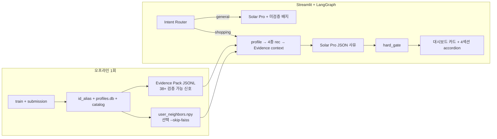

# LLM 커머스 추천 MVP — 통합 로드맵 (1페이지)

| 항목 | 내용 |
| ---- | ---- |
| 최종 수정 | 2026-05-28 |
| 통합 근거 | [`LLM_Based_EC_RecSys_MVP.md`](LLM_Based_EC_RecSys_MVP.md) (실행·추천) + [`LLM_RECSYS_SERVICE_PLAN.md`](LLM_RECSYS_SERVICE_PLAN.md) (검증·UI) |
| LLM | Upstage Solar Pro (`solar-pro3`) |
| 한 줄 목표 | **4종 추천을 Python이 고르고, Evidence Pack + hard_gate로 Solar Pro 설명을 검증 가능하게 보여주는 Streamlit 데모** |

---

## 1. 통합 설계 원칙

| 원칙 | 출처 | 내용 |
| ---- | ---- | ---- |
| LLM은 고르지 않는다 | MVP | 상품 선정 = submission + 4종 규칙 엔진 |
| LLM은 설명만 한다 | MVP | Solar Pro = 자연어 사유 (후보 JSON 고정) |
| alias는 표시용 | SERVICE | Semantic ID에서 속성 **추론 금지** — 속성은 Evidence Pack JSON 필드로 전달 |
| shopping만 자동 검증 | SERVICE | general = ⚠️ 미검증 배지, shopping = hard_gate 통과 후 표시 |
| 세션 멀티턴 O, 재질의 X | MVP | MemorySaver + thread_id (유저 ID 기억). "더 싼 걸로" 등 파라미터 변경은 Phase 2 |

---

## 2. 아키텍처 (한 장)



**RAG 정의**: `user_alias` 키 lookup (SQLite + JSON). FAISS는 **유사 유저 CF 전용**만.

---

## 3. 추천 4섹션 + 검증 수준

| # | 섹션 | 선정 로직 (MVP) | Evidence / 검증 (SERVICE) |
| - | ---- | --------------- | ------------------------- |
| 0 | **모델 Top-10** | submission Top-10 그대로 | `ensemble_rank`, `model_hit_count`, `models_recommending` — **완전 검증** |
| 1 | 비슷한 분들이 산 | FAISS Top-20 + purchase/cart, unseen | CF 신호 확장 시 (`cf_neighbor_*`) — **선택** |
| 2 | 내 취향 | profile × submission, unseen·미구매 제외 | `brand_affinity`, `category_l2_affinity`, `price_in_user_band` |
| 3 | 새로 나온 | recency_pool − seen_items, 카테고리 fallback | `item_recent_trend_ratio`, `category_l2_affinity` |
| 4 | 다시 볼 만한 | seen_items revisit score (TIFU 가중) | seen 풀 — dedup 제외, seen&lt;3이면 섹션 숨김 |

**Dedup (unseen 1~3)**: submission(0) > collaborative > content > recency. **Revisit(4) 독립.**

---

## 4. 핵심 산출물

```
rag_data/
├── id_aliases/{user,item}_alias.json
├── user_profiles.db
├── item_catalog.json
├── user_recommendations.json      # model_recs
├── recency_pool.json
├── evidence_pack.jsonl            # 유저×추천별 38+ 신호
└── user_neighbors.{npy,pkl}       # + user_alias_to_row.pkl (선택)

service/mvp/
├── id_alias.py · user_profile.py · build_rag_index.py
├── evidence_pack.py               # 신호 집계 + evidence_keys()
├── recommenders.py · trust_gate.py
├── graph_state.py · nodes.py · graph.py   # LangGraph, graph.py 전역 compile
└── solar_client.py

service/mvp/ui/app.py                     # 대시보드 + 챗 + trust_badge
```

---

## 5. 구현 Phase (약 2주)

| Phase | 기간 | 할 일 | 완료 기준 |
| ----- | ---- | ----- | --------- |
| **P0** | 2~3일 | alias, SQLite 프로필, catalog, submission join, `--skip-faiss` 빌드 | 10명 샘플 유저 프로필·별칭 수동 확인 |
| **P1** | 2일 | Evidence Pack 빌드, 4종+Top10 recommenders, dedup | `recommenders.py` 단독 테스트 통과 |
| **P2** | 2일 | LangGraph 노드, hard_gate, Solar JSON prompt | Streamlit 없이 `app.invoke()` E2E |
| **P3** | 1일 | Streamlit: dropdown, 5섹션 UI, evidence chips, general 배지 | 데모 시나리오 3개 재현 |
| **P4** | 선택 | FAISS full build, SelfCheckGPT/Calibration, golden set | CF 섹션 + groundedness 점수 |

**빠른 시작**

```bash
python -m pipeline.build_rag_index --submission outputs/submission_reranker_lgbm.csv --skip-faiss --sample 1000
streamlit run service/mvp/ui/app.py   # UPSTAGE_API_KEY in .env
```

---

## 6. UI 스케치 (통합)

```
[사이드바: 김민지 (user_00001)]  [대시보드: Top-5 카드 + 📈💵🧭✅ chips]
                                 [채팅: 🔒쇼핑 | 💬일반]
                                 [프리셋: 왜? | 살까? | 더 싼? | 취향?]
                                 [4+1 accordion + trust_badge / ⚠️미검증]
```

---

## 7. 리스크 Top 3 → 대응

| 리스크 | 대응 |
| ------ | ---- |
| LLM 상품 지어냄 | Python 후보 고정 + hard_gate item 범위 검사 |
| alias에서 속성 환각 | SYSTEM_PROMPT 규칙 8 + Evidence JSON 병행 |
| CF/FAISS 미구현 | `--skip-faiss` → collaborative 섹션 숨김 |

---

## 8. 문서 역할 분담

| 문서 | 언제 보나 |
| ---- | --------- |
| **이 파일** | 착수·일정·통합 방향 |
| [`LLM_Based_EC_RecSys_MVP.md`](LLM_Based_EC_RecSys_MVP.md) | LangGraph, FAISS, 4종 로직, alias 상세 |
| [`LLM_RECSYS_SERVICE_PLAN.md`](LLM_RECSYS_SERVICE_PLAN.md) | Evidence Pack 스키마, trust_gate, UI/평가 |

**MVP 1.0 Done 정의**: 사이드바 유저 선택 → shopping 질문 1회 → 5섹션 추천 + hard_gate 통과 설명 + general은 미검증 배지.
