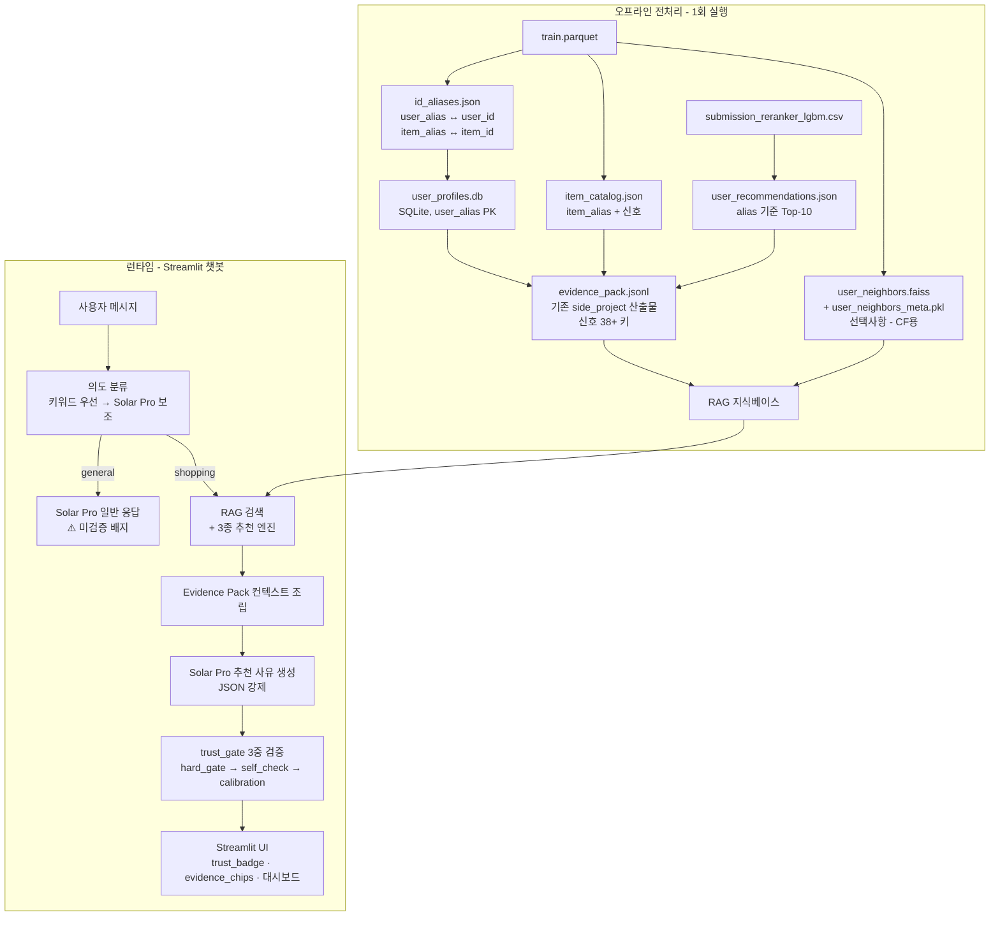
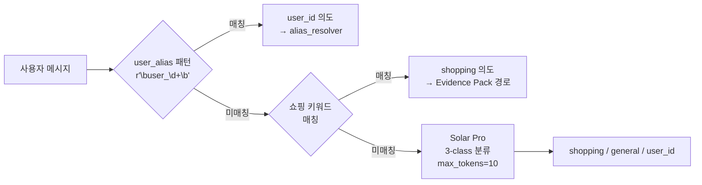

# Commerce AI Advisor — LLM 기반 커머스 추천 어드바이저 서비스 기획

| 항목 | 내용 |
| ---- | ---- |
| 최종 수정 | 2026-05-28 |
| LLM | Upstage **Solar Pro** API (`solar-pro`) |
| 파이프라인 | Evidence Pack + 의도 분류 → trust_gate 3중 검증 |
| UI | Streamlit (대시보드 + 챗봇, shopping/general 분기) |
| 개요 | 경진대회 추천 모델 결과(submission CSV)와 train.parquet를 Evidence Pack으로 가공해, 채팅 기반 쇼핑 추천 설명 MVP. shopping 모드는 모든 LLM 주장이 Evidence Pack 키로 자동 검증된다. |

상세 구현: [`side_project/`](side_project/). 팀원 방향 참고: [`LLM_Based_EC_RecSys_MVP.md`](LLM_Based_EC_RecSys_MVP.md).

---

## 목표

경진대회에서 만든 **추천 모델 결과(submission CSV)** 와 **학습 데이터(train.parquet)** 를 재활용해, 사용자가 채팅으로 대화하면:

1. **일반 대화**와 **쇼핑 추천**을 구분하고 (의도 분류)
2. 사용자 ID(또는 프로필)를 입력하면 **과거 행동 기반**으로
3. **추천 사유를 자동 검증 가능한 형태**로 설명하는 MVP

**핵심 제약 (팀 첫 의문에 대한 답)**:  
"LLM 응답을 평가할 수 있는가?" → **shopping 모드에서는 YES**. 모든 주장이 `evidence_ref`로 Evidence Pack 실제 값과 자동 대조된다.

---

## 전체 아키텍처



---

## 1. 활용할 기존 자산

| 자산 | 경로 | MVP에서의 역할 |
| ---- | ---- | -------------- |
| 행동 로그 | `data/train.parquet` | 유저 프로필, 상품 메타, EDA 신호 계산 |
| 최종 추천 | `outputs/submission_reranker_lgbm.csv` | **NDCG@10 검증된 Top-10** → RAG 1순위 근거 |
| Evidence Pack | `side_project/data/evidence_pack.jsonl` | LLM이 참조하는 구조화 근거 JSON |

> **submission을 Evidence Pack으로 쓰는 의미**: LLM이 무작위로 추천하는 게 아니라, 이미 NDCG@10으로 검증된 추천 결과를 근거로 설명한다. train 데이터는 "왜 이 유저에게 맞는지"를 설명하는 프로필·맥락을 제공한다.

---

## 2. ID 별칭 시스템

원본 UUID를 UI·채팅·LLM prompt에 직접 노출하지 않는다. **오프라인 1회 생성**하는 양방향 매핑 테이블.

### A. User Alias

| 필드 | 예시 | 설명 |
| ---- | ---- | ---- |
| `user_id` (원본) | `0b517454-e7c3-...` | 내부 lookup용 |
| `user_alias` | `user_00001` | 채팅 파싱, UI dropdown |
| `display_name` | `김민지` | dropdown 표시 전용 (중복 있음, 채팅 파싱 미사용) |

### B. Item Alias (Semantic ID)

포맷: `{L2}.{L3}.{brand_slug}.{price_bucket}_{seq:04d}`  
예: `shoes.keds.kapika.mid_0001`

**⚠️ 중요한 제약**

Semantic ID의 이점은 prompt 간결성이다. 그러나 **LLM이 ID 문자열 자체에서 속성을 추론하는 것은 금지**된다.

```
# 허용: alias를 표시에 쓰고, 속성은 Evidence Pack JSON 필드로 전달
"shoes.keds.kapika.mid_0001" + {"category_code": "apparel.shoes.keds", "brand": "kapika", ...}

# 금지: LLM이 "keds 스타일 신발"이라고 alias에서 외부 추론
→ hard_gate가 evidence_ref 없는 주장을 차단하지만,
  alias 기반 추론은 evidence_ref처럼 보이지 않아 통과될 수 있음
→ SYSTEM_PROMPT 규칙 8로 명시적 금지
```

구현 위치: `service/mvp/pipeline/id_alias.py` (팀원 방향, [`LLM_Based_EC_RecSys_MVP.md §2`](LLM_Based_EC_RecSys_MVP.md) 참고)

### C. alias가 적용되는 구간

| 구간 | 적용 방식 |
| ---- | --------- |
| Streamlit dropdown | `김민지 (user_00001)` |
| 채팅 입력 파싱 | `user_\d+` 패턴만 허용 |
| Solar Pro prompt | alias 표시 + Evidence Pack JSON 구조화 필드 병행 주입 |
| UI 카드 | `shoes.keds.kapika.mid_0001 · ₩72.05` |
| hard_gate | alias는 `evidence_keys()`에 포함되지 않음 → alias를 `evidence_ref`로 쓰면 차단 |

---

## 3. Evidence Pack (모든 것의 중심)

LLM이 근거로 삼는 **단 하나의 진실 소스**. 스키마: [`side_project/evidence_pack/schema.py`](side_project/evidence_pack/schema.py).

### 신호 갈래

**1. train.parquet 자체 계산 신호** (본체 모델 무관)

| 필드 | 의미 | 검증 방식 |
| ---- | ---- | --------- |
| `item_pop_log1p` | 전체 인기도 log1p | 숫자 > 0 |
| `item_recent14_pop_log1p` | 최근 14일 인기도 | 숫자 > 0 |
| `brand_affinity` | view/cart/purchase 기반 선호 브랜드 일치 | bool true |
| `category_l2_affinity` | L2 카테고리 선호 일치 | bool true |
| `price_in_user_band` | 사용자 가격대(median±1.5×IQR) 안에 있음 | bool true |
| `item_v2c_smoothed` | smoothed view→cart 전환율 | 숫자 > 0 |
| `item_v2p_smoothed` | smoothed view→purchase 전환율 | 숫자 > 0 |
| `item_recent_trend_ratio` | 최근 14일 vs 직전 14일 조회 비율 | 숫자 > 0 |

**2. 본체 옵션 신호** (submission에 없으면 기본값 0/False)

| 필드 | 의미 |
| ---- | ---- |
| `models_recommending` | 이 아이템을 추천한 모델 목록 |
| `model_hit_count` | 동의한 모델 수 |
| `ensemble_rank` | 최종 앙상블 순위 |
| `cart_boosted` | 장바구니 boosted 여부 |

**3. 표시 전용 (evidence_keys 밖)**

| 필드 | 이유 |
| ---- | ---- |
| `user_alias` | display identifier, 근거 아님 |
| `item_alias` | display identifier, 외부 추론 위험 |

### 평가 가능성의 토대

`EvidencePack.evidence_keys()`가 자동 생성하는 화이트리스트를 hard_gate가 그대로 사용. 스키마에 새 신호를 추가하면 → 자동으로 검증 가능한 키로 편입.

```python
pack = EvidencePack(...)
allowed = pack.evidence_keys()   # 38+ 키 자동 생성
# alias 필드는 evidence_keys()에서 제외됨
assert "user_alias" not in allowed
assert "item_alias" not in allowed
```

---

## 4. 의도 분류 (Intent Router)

구현: [`side_project/advisor/prompts.py`](side_project/advisor/prompts.py) `classify_intent()`



```python
SHOPPING_KEYWORDS = frozenset({
    "추천", "상품", "쇼핑", "구매", "브랜드", "뭐 살까", "골라줘",
    "어울리는", "왜 추천", "살까", "더 싸", "취향", "신상",
})
```

| 의도 | 경로 | trust_gate | 평가 가능 |
| ---- | ---- | ---------- | --------- |
| `shopping` | Evidence Pack → hard_gate → self_check → calibration | ✅ | ✅ |
| `user_id` | alias resolver → shopping 경로 | ✅ | ✅ |
| `general` | Solar Pro 직접 → ⚠️ 미검증 배지 | ❌ | ❌ |

---

## 5. 3가지 추천 범주 + LLM 사유

각 유형당 Top-3~5개 후보를 **Python 규칙 엔진**이 선정한 뒤, Solar Pro가 **사유만** 자연어로 작성.

### 유형 1: Submission 기반 (기본, 평가 완전)

```
입력: user_recommendations.json (submission Top-10)
로직: NDCG@10 검증된 결과를 그대로 Evidence Pack에 반영
평가: Evidence Pack 전체 신호로 완전 검증 가능
```

### 유형 2: 프로필 기반 Content (평가 가능)

```
입력: user_profiles.db + item_catalog.json
로직:
  1. top_categories_l2 / top_brands 매칭 (brand_affinity, category_l2_affinity)
  2. submission Top-10 중 해당 카테고리/브랜드 우선
  3. 가격대(price_in_user_band) 필터
평가: brand_affinity · category_l2_affinity · price_in_user_band 키로 검증
```

### 유형 3: 신상품/Unseen (부분 평가)

```
입력: item_catalog.json (last_seen_date) + user_profile (seen_items)
로직:
  0. unseen 필터 (seen_items 제외) + 최근 14일 등장 상품
  1. top_categories_l2 교집합
  2. submission 순위 가중 정렬
  fallback: unseen+카테고리+브랜드 → unseen+카테고리 → unseen만
평가: item_recent_trend_ratio · category_l2_affinity 신호로 부분 검증
```

### (선택) 유형 4: CF 기반 Collaborative

```
입력: user_neighbors.faiss + purchase/cart 이력
로직: Top-20 유사 유저 purchase > cart 점수 합산, unseen 필터
평가: ⚠️ Evidence Pack 확장 필요
      → ItemSignals에 cf_neighbor_count, cf_neighbor_purchase_ratio 추가 후 검증 가능
```

### LLM 역할 분리

| 단계 | 담당 | 이유 |
| ---- | ---- | ---- |
| 후보 선정 | Python 규칙 엔진 | 없는 상품 hallucination 방지 |
| 추천 사유 작성 | Solar Pro | 자연스러운 한국어 설명 |
| 의도 분류 | 키워드 우선 → Solar Pro 보조 | API 비용 절감 |

---

## 6. 신뢰성 게이트 — shopping 모드 전용

| 게이트 | 논문 | 역할 | 적용 모드 |
| ------ | ---- | ---- | --------- |
| **RAG grounding** | - | Evidence Pack으로 입을 묶음, 근거 밖 발화 차단 | shopping만 |
| **Hard-gate** | - | 스키마·화이트리스트·truthy·bool 모순 검사 | shopping만 |
| **SelfCheckGPT** | arXiv:2303.08896 | N샘플 일관성, 환각 탐지 | shopping만 |
| **Calibration** | Guo et al. 2017 | confidence_raw → 실제 적중률 보정 (ECE) | shopping만 |
| **LLM-as-Judge** | MT-Bench, G-Eval | golden set 회귀 채점 | shopping 응답만 |

**general 모드는 어떤 게이트도 통과하지 않는다.** trust_gate의 모든 보장은 shopping 경로에만 적용.

### Hard-gate 검사 항목

```python
# 5가지 결정적 검사 (하나라도 실패 → 거부)
1. user_id가 pack과 일치
2. item_id가 pack.recommendations 안에 있음 (범위 밖 = 환각)
3. 모든 claim.evidence_ref가 evidence_keys() 화이트리스트 안에 있음
4. 각 evidence_ref 실제 값이 truthy (False/0/빈컬렉션 인용 금지)
5. bool True 근거를 부정형 문장으로 설명하면 모순으로 차단
```

---

## 7. Streamlit UI

### 사용자 탭

```
┌─ 사이드바 ─┐ ┌── 추천 대시보드 ────────────────────┐ ┌── 질문하기 ─────────────────────┐
│ 김민지     │ │ #1 shoes.keds.kapika.mid_0001 · ₩72 │ │ 대상: #1 kapika                │
│ user_00001 │ │  📈인기↑  💵가격대  🧭선호  ✅2모델 │ │                                │
│ T=0.974   │ │ [이 카드 보기]                      │ │ 🔒 쇼핑 질문 (Evidence 기반)   │
│ Mock      │ │ #2 ...  #3 ...                      │ │ [왜?][살까?][더 싼 대안][취향?]│
└────────────┘ └─────────────────────────────────────┘ │                                │
                                                        │ 💬 자유 입력 → 의도 분류       │
                                                        │ [입력창]                       │
                                                        │                                │
                                                        │ ── 채팅 히스토리 ──             │
                                                        │ 🛍 shopping: trust_badge 표시  │
                                                        │ ⚠️ general: 미검증 배지         │
                                                        └─────────────────────────────────┘
```

### 운영자 탭

```
┌── 카테고리(l2) 집계 ─────────────────┐ ┌── 브랜드 집계 ─────────────────────┐
│ shoes | views | purchases | v2p | trend│ │ kapika | views | purchases | v2p   │
└──────────────────────────────────────┘ └────────────────────────────────────┘

집계 축: [카테고리(l2)] [브랜드]
그룹 선택: shoes
대표 아이템: shoes.keds.kapika.mid_0001 · v2p=0.005 · trend=1.37
[카테고리 왜 떠?] [프로모션?] [단종?]
응답 (Evidence Pack 기반, trust_gate 통과)
```

---

## 8. 구현 단계 (권장 순서)

### Phase 1: 기존 side_project 연결 (현재 완료)

```bash
cd side_project
pip install -r requirements.txt
python -m evidence_pack.builder --adapter mock --out data/evidence_pack.jsonl
streamlit run ui/app.py
```

### Phase 2: ID 별칭 + 프로필 빌드 (팀원 방향, [`LLM_Based_EC_RecSys_MVP.md`](LLM_Based_EC_RecSys_MVP.md))

1. `service/mvp/pipeline/id_alias.py` — user/item Semantic ID 테이블 생성
2. `service/mvp/pipeline/user_profile.py` — 프로필 집계 → `user_profiles.db`
3. `service/mvp/pipeline/build_rag_index.py` — alias + 프로필 + submission join
4. 샘플 10명 유저로 별칭·프로필·추천 결과 수동 검증

### Phase 3: 3종 추천 엔진

1. `service/mvp/pipeline/recommenders.py` — submission 기반 + content + recency
2. `evidence_pack/adapter.py`에 새 `AliasCSVAdapter` 추가 (alias ↔ 원본 변환)
3. dedup 규칙 적용 (submission > content > recency)
4. (선택) CF 엔진 + `ItemSignals`에 cf_neighbor 필드 확장

### Phase 4: Streamlit 챗봇 고도화

1. `ui/app.py` — MemorySaver 기반 멀티턴 (LangGraph 또는 session_state)
2. 추천 결과 3섹션 accordion
3. 대화 초기화 버튼

---

## 9. 구현 체크리스트

| # | 작업 | 산출물 | 상태 |
| - | ---- | ------ | ---- |
| 1 | Evidence Pack 빌드 (EDA 신호 포함) | `side_project/evidence_pack/` | ✅ |
| 2 | Solar Pro advisor + mock fallback | `side_project/advisor/` | ✅ |
| 3 | trust_gate 3중 검증 | `side_project/trust_gate/` | ✅ |
| 4 | Streamlit 데모 (대시보드 + 제한 챗) | `side_project/ui/` | ✅ |
| 5 | 의도 분류 + general 모드 분기 | `side_project/advisor/prompts.py`, `ui/app.py` | ✅ |
| 6 | 평가 / golden set | `side_project/eval/` | ✅ (라벨링 필요) |
| 7 | ID 별칭 빌드 | `service/mvp/pipeline/id_alias.py` | 📋 계획 |
| 8 | SQLite 유저 프로필 | `service/mvp/pipeline/user_profile.py` | 📋 계획 |
| 9 | 3종 추천 엔진 | `service/mvp/pipeline/recommenders.py` | 📋 계획 |
| 10 | FAISS 유사 유저 (선택) | `rag_data/user_neighbors.*` | 📋 선택 |

---

## 10. 리스크와 대응

| 리스크 | 대응 |
| ------ | ---- |
| LLM이 없는 상품을 지어냄 | 후보 item_id Python 고정, hard_gate가 범위 밖 item_id 차단 |
| alias에서 LLM 외부 추론 | SYSTEM_PROMPT 규칙 8, Evidence Pack 구조화 필드 병행 주입 |
| general 모드 hallucination | 의도적 설계. ⚠️ 미검증 배지로 사용자에게 명시 |
| CF 후보 검증 불가 | Evidence Pack에 cf_neighbor 필드 추가 선행 후 CF 엔진 도입 |
| Calibration 포화 | golden set label 다양화 (현재 all-True → T saturate) |
| 구매 희소 (0.02%) | 운영자 지표는 category/brand 단위 집계 |

---

## 11. MVP 범위 밖 (후속 확장)

- **실시간 행동 반영** (현재 고정 데이터 기준)
- **멀티턴 쇼핑 대화** 고도화 ("더 저렴한 걸로", "다른 브랜드는?")
- **FAISS 기반 CF 엔진** + Evidence Pack cf_neighbor 확장
- **LangGraph 파이프라인** (노드별 독립 테스트, MemorySaver 세션 관리)
- **벡터 DB 임베딩 RAG** (카테고리 자연어 검색, 현재는 key 기반 lookup)
- **display_name 채팅 입력 지원** (동명이인 disambiguation 포함)

---

## 12. 정직한 한계

1. **온라인 A/B·인과 uplift 불가** — 오프라인 proxy(groundedness/품질 점수)만 가능
2. **구매/장바구니 희소** — 운영자 지표는 카테고리/브랜드 단위로만 의미 있음
3. **general 모드 응답은 평가 불가** — 이는 의도적 설계. UI 배지로 사용자에게 명시
4. **Calibration은 라벨 의존** — golden set 품질이 보정 품질을 결정
5. **LLM-Judge 자체 bias** — 완화책을 써도 상대 비교·회귀 감지 용도로만 신뢰
6. **alias 외부 추론** — SYSTEM_PROMPT로 방어하나, prompt를 어기는 LLM 응답은 hard_gate가 Evidence Pack 근거 없는 주장으로 차단

---

## 용어 사전

| 용어 | 한 줄 설명 |
|---|---|
| **Evidence Pack** | 추천 1건마다 따라오는 근거 묶음. LLM이 말할 수 있는 유일한 재료 (shopping 모드). |
| **User/Item Alias** | 표시용 별칭 (`user_00001`, `shoes.keds.kapika.mid_0001`). evidence_ref로 사용 불가. |
| **Shopping 모드** | Evidence Pack + trust_gate 경로. 자동 평가 가능 구간. |
| **General 모드** | Solar Pro 직접 경로. Evidence Pack 없음. ⚠️ 미검증 배지. |
| **Groundedness** | LLM의 말이 Evidence Pack에 실제로 뒷받침되는 정도. |
| **Hard-gate** | 코드로 형식·근거를 검사해 불합격이면 응답을 막는 결정적 관문. |
| **SelfCheckGPT** | 같은 질문을 여러 번 시켜 답이 흔들리면 환각으로 의심하는 기법. |
| **Calibration / ECE** | 모델 확신과 실제 적중률 차이를 줄이는 보정 / 오차 지표. |
| **LLM-as-Judge** | 강한 LLM을 채점관으로 써서 응답 품질을 매기는 평가법 (shopping 모드만). |
| **Intent Router** | 의도 분류기. 키워드 우선 → Solar Pro fallback으로 shopping/general 경로 결정. |
