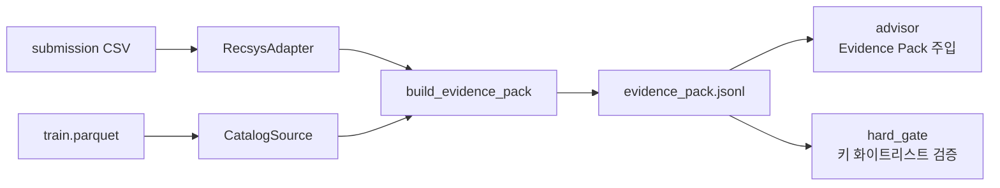

# evidence_pack/ — 근거 묶음(Evidence Pack) 빌드

| 항목 | 내용 |
| ---- | ---- |
| 최종 수정 | 2026-05-28 |
| 입력 | submission CSV + train.parquet (또는 MockAdapter) |
| 출력 | `evidence_pack.jsonl` — 사용자 1명당 1줄 |
| 신호 수 | `EvidencePack.evidence_keys()` 동적 생성 (alias 필드 제외) |

---

## 무엇인가

본체 추천기가 만든 top-K 추천에 **인기도·과거 이력·카탈로그 메타·EDA 기반 전환/선호 신호**를 더해 사용자 1명당 1개의 JSON으로 만든다. 이게 LLM이 답할 때 "**근거**"로 삼는 단 하나의 진실 소스다.

EDA에서 강한 신호로 확인된 항목을 직접 담는다:
- view 기반 사용자 `category_l2`/brand 선호 (74.8%/46.5% 매칭률)
- 사용자 view 가격대 median/IQR와 추천 아이템 가격대 적합 여부 (86.8% 구매 적중)
- 아이템별 view/cart/purchase count와 smoothed view→cart/view→purchase conversion
- 최근 14일 view와 직전 14일 view의 trend ratio
- revisit 후보용 event weight × temporal decay × repeat bonus, cart_without_purchase 신호

---

## 왜 필요한가

LLM은 잘 지어낸다. 그래서 **말하기 전에 입을 묶어야** 한다. Evidence Pack이 곧 LLM이 말할 수 있는 재료의 전부다. → LLM의 모든 문장이 이 JSON의 키 하나에 1:1로 대응되도록 강제하면 ([`../trust_gate/hard_gate.py`](../trust_gate/hard_gate.py)), **자동 검증이 가능**해진다.

---

## 추천시스템·LLM과 어떻게 연결되나



- 본체 → 이 폴더: `RecsysAdapter` Protocol 한 층으로만 연결. 본체 코드 import 없음.
- train.parquet → 이 폴더: `ParquetCatalogSource`가 카탈로그·히스토리·전환율·trend 집계.
- 이 폴더 → LLM 레이어: JSONL 한 파일만.

---

## 입력 / 출력

| | 출처 | 형태 |
|---|---|---|
| **입력** (필수) | 본체 submission CSV 또는 MockAdapter | `(user_id, item_id)` 롱 포맷 |
| **입력** (보조) | train.parquet 또는 MockAdapter | 이벤트 로그 |
| **입력** (옵션) | 본체가 제공하면 활용 | 모델별 rank, cart_boosted, ensemble_rank |
| **출력** | `data/evidence_pack.jsonl` | 사용자 1명당 1줄 |

---

## 출력 스키마 (요약)

```json
{
  "user_id": "0b517454-...",
  "user_alias": "user_00001",
  "user_context": {
    "total_events": 124,
    "top_categories": ["apparel.shoes"],
    "top_brands": ["kapika"],
    "price_median": 72.05,
    "price_iqr": 45.20
  },
  "recommendations": [
    {
      "rank": 1,
      "item_id": "18c11cbb-...",
      "item_alias": "shoes.keds.kapika.mid_0001",
      "category_code": "apparel.shoes.keds",
      "brand": "kapika",
      "price": 72.05,
      "signals": {
        "item_pop_log1p": 6.2,
        "brand_affinity": true,
        "category_l2_affinity": true,
        "price_in_user_band": true,
        "item_v2c_smoothed": 0.0148,
        "item_v2p_smoothed": 0.0027,
        "item_recent_trend_ratio": 1.37,
        "revisit_score": 0.82,
        "last_event_type": "cart",
        "last_interaction_days": 5,
        "revisit_event_count": 3,
        "cart_without_purchase": true
      }
    }
  ]
}
```

**alias 필드 주의**: `user_alias`와 `item_alias`는 **표시 전용**. `evidence_keys()`에 포함되지 않으며 LLM 주장의 `evidence_ref`로 사용 불가. alias 문자열에서 속성을 추론하는 것도 SYSTEM_PROMPT 규칙 8로 금지.

전체 스키마: [`schema.py`](schema.py). `EvidencePack.evidence_keys()`로 허용 키 확인.

```python
pack = EvidencePack(...)
keys = pack.evidence_keys()
# "user_alias" NOT in keys  ← alias는 화이트리스트 밖
# "signals.brand_affinity" in keys  ← EDA 신호는 검증 가능
```

---

## 사용 예시

### 본체 없이 (mock으로 끝까지)

```bash
python -m evidence_pack.builder --adapter mock --out data/evidence_pack.jsonl
# → Wrote 50 evidence packs to data/evidence_pack.jsonl
```

### 본체 완성 후 (실데이터)

```bash
python -m evidence_pack.builder \
  --adapter csv --submission-csv /path/to/sample_submission.csv \
  --catalog parquet --train-parquet /path/to/train.parquet \
  --out data/evidence_pack.jsonl \
  --catalog-cache data/catalog_cache.pkl
```

### alias 필드 채워서 빌드 (ID alias 시스템 연동)

```python
from evidence_pack import MockAdapter, build_evidence_pack, iter_evidence_pack

mock = MockAdapter()
build_evidence_pack(mock, mock, "data/evidence_pack.jsonl", max_users=10)

for pack in iter_evidence_pack("data/evidence_pack.jsonl"):
    # alias 필드는 빌더 또는 후처리로 채움
    # pack.user_alias = alias_map[pack.user_id]
    print(pack.user_id, pack.user_alias, len(pack.recommendations))
```

---

## 수정·확장 포인트

| 하고 싶은 것 | 어디서 |
|---|---|
| 새 신호 추가 | `schema.py` `ItemSignals` 필드 추가 → `adapter.py` 집계 → `builder.py` 매핑 |
| revisit 점수 조정 | `builder.py` `EVENT_WEIGHT`, `HALF_LIFE_DAYS`, `recommend_revisit()` |
| alias 필드 채우기 (실데이터) | `pipeline/build_rag_index.py`가 자동 처리 — Phase 2 실행하면 됨 |
| 본체 submission 연결 | `adapter.py` `AliasCSVAdapter` — `pipeline/id_aliases.json` 생성 후 사용 |
| 본체 풍부한 신호 추가 | `adapter.py` `get_rich_signals()` 구현 |
| CF 후보 증거 추가 | `ItemSignals`에 `cf_neighbor_count`, `cf_neighbor_purchase_ratio` 필드 추가 |
| partial build 빠른 확인 | `--max-users 200` |

---

## 조정 다이얼

### `adapter.py` — Mock 데이터 분포

| 위치 | 기본 | 의미 | 조정 |
|---|---|---|---|
| `MockAdapter(n_users=)` | 50 | mock 사용자 수 | 100~200까지 무거움 없음 |
| `MockAdapter(top_k=)` | 10 | 사용자당 추천 수 | **본체와 반드시 일치** |
| `MockAdapter(seed=)` | 42 | 결정성 | 바꾸면 다른 mock 데이터셋 |

### `adapter.py` — 본체 데이터 집계

| 위치 | 기본 | 의미 | 조정 |
|---|---|---|---|
| `ParquetCatalogSource(recent_days=)` | 14 | 최근 인기 윈도우(일) | 데이터 기간 따라 7~30 |
| `ParquetCatalogSource(conversion_alpha=)` | 50.0 | smoothing 강도 | ↑하면 희소 item이 global prior에 가까워짐 |
| `recommend_revisit(EVENT_WEIGHT)` | cart 1.0 / purchase 0.3 / view 0.2 | 재방문 후보 이벤트 가중치 | cart_without_purchase를 가장 강하게 노출 |
| `recommend_revisit(HALF_LIFE_DAYS)` | 14 | 시간 감쇠 반감 기준 | ↑하면 오래된 관심도 더 남음 |

### `schema.py` — 새 신호 추가

`ItemSignals` / `UserContext`에 필드 추가 → 화이트리스트 자동 확장.  
필드 기본값은 0 / [] / False / None — 본체가 안 줘도 깨지지 않게 설계.  
**alias 필드는 `evidence_keys()` 제외 목록에 유지**할 것.

---

## 한계

- **rich signals는 본체가 제공해야만 채워짐** — CSV만 있으면 `ranks={}`, `model_hit_count=0`
- **alias 필드 채우기는 id_alias 모듈 연동 필요** — 현재 builder는 alias를 None으로 남김
- partial build는 빠른 검증용. 전체 운영 산출물은 `--max-users` 없이, `--catalog-cache` 활용
- pydantic 검증으로 잘못된 타입은 builder 단계에서 fail-fast
