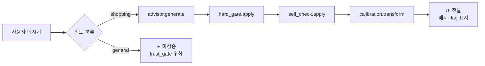

# trust_gate/ — 응답을 거르는 3중 게이트

| 항목 | 내용 |
| ---- | ---- |
| 최종 수정 | 2026-05-28 |
| 적용 모드 | **shopping 모드 전용** (general 모드는 통과하지 않음) |
| 게이트 수 | 3중 (Hard-gate → SelfCheckGPT → Calibration) |
| 평가 가능성 | shopping 모드의 모든 주장이 evidence_ref로 자동 검증됨 |

---

## 무엇인가

LLM 응답을 그대로 보여주면 위험하다. 이 폴더는 **shopping 모드** 응답이 UI로 가기 전 통과해야 할 **3중 게이트**를 코드로 닫는다:

1. **Hard-gate** ([`hard_gate.py`](hard_gate.py)) — 결정적 검사 (스키마·근거 키·근거 값·간단 모순)
2. **SelfCheckGPT** ([`self_check.py`](self_check.py)) — N샘플 일관성으로 환각 탐지
3. **Calibration** ([`calibration.py`](calibration.py)) — confidence_raw를 실제 적중률에 맞게 보정

> **general 모드 응답은 이 폴더를 통과하지 않는다.** 의도적 설계. UI에서 ⚠️ 미검증 배지로 명시.

---

## 왜 필요한가 — 각 게이트의 역할

| 게이트 | 막는 것 | 한 줄 비유 |
|---|---|---|
| Hard-gate | 형식 깨짐 / 범위 밖 item_id / 근거 없는 인용 / bool 근거와 부정형 문장의 직접 모순 | **자물쇠** |
| SelfCheck | 사실관계 흔들림(환각) | **일관성 검사** |
| Calibration | 거짓 자신감 / 거짓 겸손 | **저울** |

---

## 추천시스템·LLM과 어떻게 연결되나



- Hard-gate는 **Evidence Pack의 키 화이트리스트**(`pack.evidence_keys()`)를 그대로 사용
- `__init__.py`는 lazy export로 `python -m trust_gate.hard_gate` 단독 실행 시 중복 import 경고 없음

---

## 핵심 파일

### hard_gate.py

- `check_response(pack, response) → list[failure_str]`: 검사 실패 목록 (빈 리스트=통과)
- `apply_hard_gate(pack, response) → response`: response에 `hard_gate_passed`, `flags` 채워 반환
- `get_evidence_value(pack, rec, ref)`: evidence_ref가 가리키는 실제 값

검사 항목:
1. `user_id` 일치
2. `item_id`가 pack.recommendations 안에 있음
3. 모든 `claim.evidence_ref`가 `pack.evidence_keys()` 화이트리스트
4. 각 evidence_ref가 가리키는 값이 **truthy** (False/0/빈 컬렉션/빈 문자열 인용 금지)
5. bool true 근거를 부정형 문장("없", "아니", `\b(not|no|never)\b`)으로 설명하면 차단

> **alias 필드 (`user_alias`, `item_alias`)는 화이트리스트 밖** — LLM이 alias를 evidence_ref로 쓰면 자동 차단.

### self_check.py

- `self_check_consistency(samples) → {score, per_ref, n_samples}`
- `apply_self_check(samples, threshold=0.5) → target`: 첫 sample에 `self_check_score`와 `wobbly` flag

알고리즘:
1. N개 응답 생성 (temperature↑)
2. 각 sample의 evidence_ref 집합 추출
3. 첫 sample의 각 ref가 다른 sample들에 등장하는 비율 = ref별 일관성
4. 평균 = `self_check_score` (1.0=완전 일관, 0.0=완전 흔들림)

### calibration.py

- `expected_calibration_error(conf, labels, n_bins=10) → float`
- `Calibrator()`: `fit(conf, labels)` → `transform(conf)` / `save(path)` / `load(path)`

Temperature scaling으로 학습. JSON 저장 → UI는 `Calibrator.load(...).transform(conf_raw)`만 호출.

---

## 사용 예시

```python
from advisor import get_client
from evidence_pack import iter_evidence_pack
from trust_gate import apply_hard_gate, apply_self_check, Calibrator

client = get_client()
calibrator = Calibrator.load("data/calibrator.json")
pack = next(iter_evidence_pack("data/evidence_pack.jsonl"))
rec = pack.recommendations[0]

# 1) shopping 모드 응답 + Hard-gate
resp = client.generate(pack, rec.item_id, "why")
apply_hard_gate(pack, resp)

# 2) SelfCheck (N=3 샘플)
samples = client.generate_samples(pack, rec.item_id, "why", n=3)
for s in samples:
    apply_hard_gate(pack, s)
target = apply_self_check(samples, threshold=0.5)

# 3) Calibration
target.confidence_calibrated = calibrator.transform(target.confidence_raw)

print(f"pass={target.hard_gate_passed}  self_check={target.self_check_score}")
print(f"raw={target.confidence_raw} → calibrated={target.confidence_calibrated:.3f}")
print(f"flags: {target.flags}")
```

---

## 수정·확장 포인트

| 하고 싶은 것 | 어디서 |
|---|---|
| 새 검사 추가 (수치 범위 등) | `hard_gate.py` `check_response`에 검사 함수 추가 |
| 의미 모순 검사 강화 | `_contradicts_value`를 ref별 정책으로 확장 |
| SelfCheck를 NLI 기반으로 | `self_check.py`에 새 함수, sentence-level NLI 모델 호출 |
| 다른 calibration 방식 (Isotonic) | `calibration.py` `Calibrator`에 method 인자 추가 |

---

## 조정 다이얼

### `hard_gate.py`

| 위치 | 기본 | 의미 | 조정 |
|---|---|---|---|
| `_is_supported` | int/float `> 0`, str/list/dict len `> 0`, bool true | 근거 truthy 기준 | revisit의 `last_event_type` 같은 문자열 근거도 검증 가능 |
| `_EN_NEGATION` | `\b(not|no|never)\b` | 영어 부정 단어 경계 정규식 | 한국어 추가: "아닌", "못" 등 |
| `_looks_negated` tokens | `없`, `아니` | 한국어 부정 | 표현 추가 가능. 과검출 주의 |

### `self_check.py`

| 위치 | 기본 | 의미 | 조정 |
|---|---|---|---|
| `apply_self_check(threshold=)` | **0.5** | wobbly flag 임계 | ↑(0.7) 엄격 / ↓(0.3) 관대 |
| `generate_samples(n=)` | 3 | 샘플 수 | ↑ 안정성↑·비용↑. **`ui/app.py`와 동기화** |

### `calibration.py`

| 위치 | 기본 | 의미 | 조정 |
|---|---|---|---|
| `expected_calibration_error(n_bins=)` | 10 | ECE bin 수 | 표본<50이면 5, >200이면 15 |
| `Calibrator.fit` `len(conf) < 3` | 3 | 미보정 임계 | golden set 작을 때 10~20으로 ↑ 권장 |

> **현재 상태 주의**: starter golden set은 label이 모두 True → T가 saturate되어 confidence가 과도하게 보정될 수 있음. 팀이 라벨을 다양화하면 자동 정상화.

---

## 한계 / 주의

- Hard-gate 기본은 **존재 검사 + 얕은 모순 검사**. 미세 의미 오류는 LLM-as-Judge와 도메인 리뷰로 별도 점검.
- **alias 기반 추론은 hard_gate가 부분적으로만 탐지** — alias 문자열에서 external knowledge를 추론해도, evidence_ref를 올바른 키로 인용하면 통과될 수 있음. SYSTEM_PROMPT 규칙 8로 1차 방어.
- SelfCheck 단순 변형은 evidence_ref 집합 기반. 더 강력한 변형(NLI/BERTScore)은 [`../eval/`](../eval/)에서 확장 가능.
- Calibration은 **라벨에 의존**. golden set ~40건 이상, 다양한 label_supported 분포 필요.
- **general 모드 응답에는 이 모듈의 어떤 함수도 호출하지 않음** — UI `ask_general()` 경로 확인.
