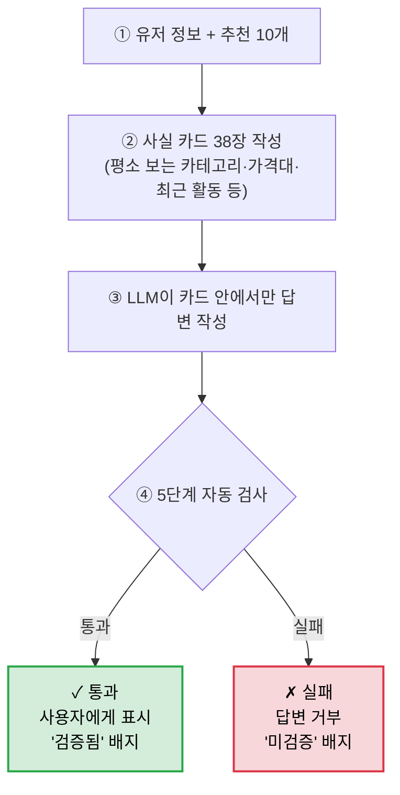

# 슬라이드 1+2

## LLM이 거짓말하지 않는 쇼핑 챗봇

```
[앞 단계 결과] 추천 상품 10개 + 유저 정보  ──▶  Stage 3 (제가 만든 부분)
```

> **문제**: 보통의 LLM 챗봇은 *"그럴듯하지만 사실 확인 안 된 말"*을 자유롭게 함.
> 예) *"이 가방, 후기가 좋아서 추천드려요"* — 후기가 정말 좋은지 누가 확인?

---

### 핵심 아이디어

LLM에게 **"참고할 사실 카드 38장"**을 미리 만들어주고, **카드 안에 적힌 사실만 인용**해서 답하라고 강제한다.
카드 밖 정보를 끌어오면 **자동으로 답변 거부**.

---

### 일반 LLM 챗봇 vs 이 설계

| | 일반 LLM 챗봇 | **이 설계** |
|---|---|---|
| 추천 상품 | LLM이 임의로 추천 | **사람이 만든 알고리즘**이 선정 (LLM 미관여) |
| 추천 사유 | 자유 발화 | **사실 카드 38장 안에서만** 인용 |
| 검증 | 사람이 하나하나 확인 | **자동 5단계 검사** → 실패시 답변 거부 |

---

### 자동 5단계 검사 — 사실 확인 체크리스트

| # | 검사 |
|---|---|
| 1 | 다른 사람 정보가 섞이지 않았나 |
| 2 | 추천 목록 밖 상품을 끌어오지 않았나 |
| 3 | 사실 카드 38장 **안에 있는 정보만** 인용했나 |
| 4 | 인용한 사실이 실제로 **맞는가** (없는 사실 지어내지 않았나) |
| 5 | 사실을 **거꾸로** 말하지 않았나 (예: "재고 있음"을 "없음"으로 둔갑) |

→ **하나라도 실패 = 답변 거부**

---

### 전체 흐름



> **한 줄 정리**: LLM이 임의로 말할 수 없는 구조 → 챗봇 답변을 **신뢰할 수 있게** 됨.

---
---

# 슬라이드 3 — 데모

### Streamlit 화면 캡처

(좌측 5섹션 카드 영역 · 우측 채팅 + **"✓ 검증됨"** 배지)

---

### 예시 비교

| 챗봇이 한 말 | 자동 검사 결과 |
|---|---|
| *"평소 자주 보시는 카테고리와 맞아 추천드려요"* | ✓ **통과** (카드에 있는 사실 인용) |
| *"재고가 적어서 빨리 사셔야 해요"* | ✗ **거부** (카드에 없는 정보를 지어냄) |
| *"오늘 날씨는 어때요?"* | ⚠️ **미검증 표시** (쇼핑 아닌 일반 대화) |

---

### 한 줄 임팩트

> 이 구조는 추천뿐 아니라 **고객 상담, 가격 안내, 의료 챗봇** 등 **"LLM이 거짓말하면 안 되는 모든 곳"**에 적용 가능.